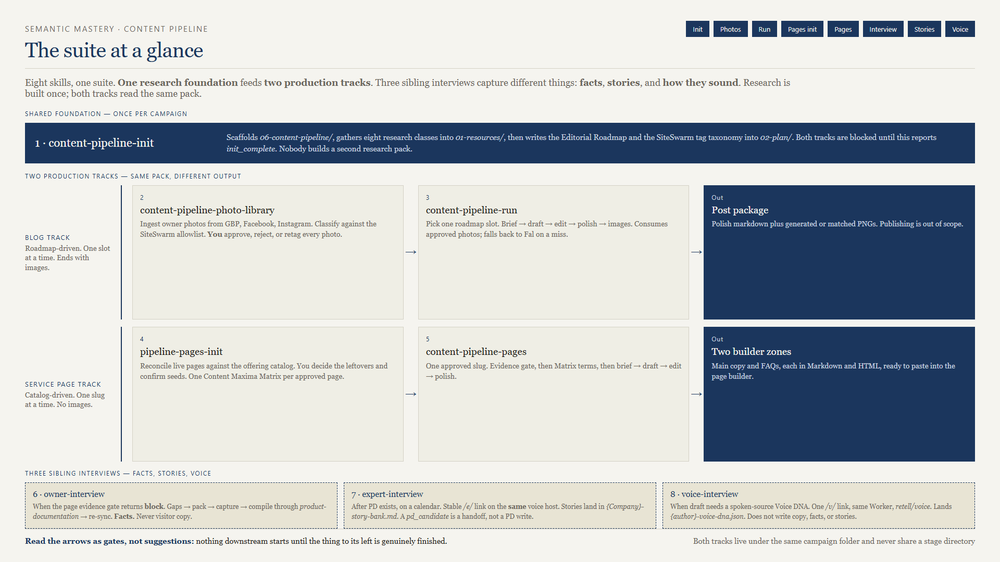
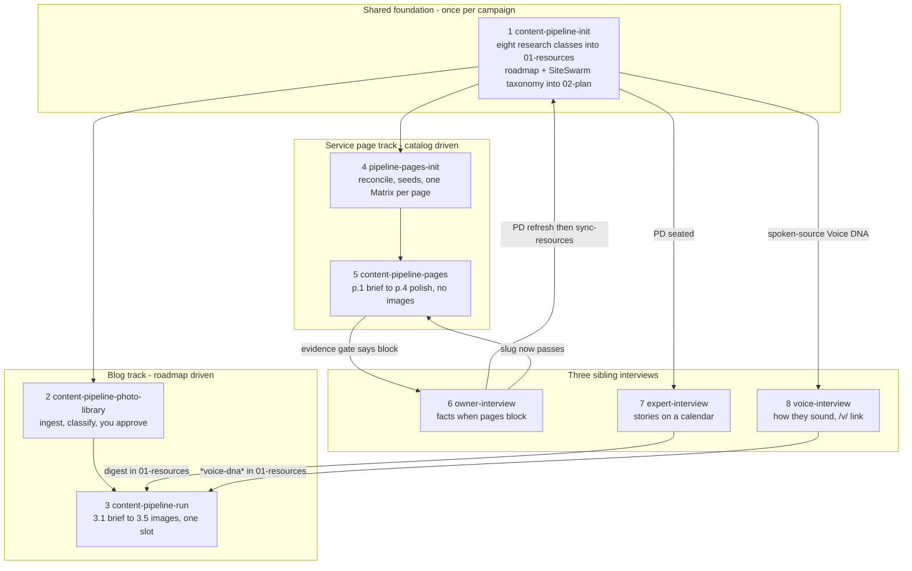

# 00 — The suite map

## The model in one sentence

**One research foundation feeding two production tracks, plus three sibling interview skills (facts, stories, how they sound).**

## Why it is built this way

A local business content program has one expensive part and one cheap part. The expensive part is **finding out what is true about the business** — what they actually sell, where, for whom, with what proof. The cheap part is arranging words.

Most AI content workflows invert that. They spend their effort on prose and let the model fill the facts. You get fluent pages that promise 24/7 arrival the business does not offer.

This suite does the expensive part once, stores it as files, and then refuses to write anything the files do not support. That refusal is the product.

## The seven things to understand before you run anything

### 1. Init is the gate for both tracks, not just blogs

`pipeline-pages-init` needs the on-page crawl and `Product-Documentation.md` that init put in `01-resources/`. There is no separate research pass for pages. If someone on your team asks "do I need to run init for the pages work too?" the answer is that init already ran, once, for the campaign.

### 2. Blogs are picked by number, pages by name

| | Blog | Page |
|---|------|------|
| Source of the work list | `02-plan/editorial-roadmap.md` | The approved page catalog in `pipeline-pages-manifest.json` |
| You say | "produce post 7" | "produce slug `emergency-service`" |
| Keyword input | Roadmap row: cluster, title, trigger word | Content Maxima Matrix: Algorithm Trigger Words |
| Stages | 5, ending in images | 4, ending in polish |
| Photos | Library, then Fal fallback | None |
| Output | Post markdown plus PNGs | Two builder zones, Markdown and HTML |

### 3. The photo library is setup work, not writing work

Whoever sets up the campaign builds the library: scrape the owner's public photos, classify them against the tag taxonomy, then approve or reject each one by hand. Writers only **consume** `approved/` at stage 3.5.

This matters operationally. If your writer opens a campaign and `approved/` is empty, that is not their problem to fix — the image stage just generates with Fal instead. Handing library HITL to a writer mid-post is how you get a two-hour detour.

### 4. owner-interview is a branch, not a step

It has exactly one trigger: `content-pipeline-pages` ran `pd-coverage.mjs` and got **block**. Too much of that page's evidence grid is Unknown, Unverified, or in Conflict.

You have two honest responses. Get the facts (run this skill) or waive the block on the record with your name attached. What you cannot do is prompt the page into existence.

### 5. expert-interview is a cadence feed, not the pages evidence gate

Run it **after** Product Documentation exists, on a calendar. It does not unblock a `pd-coverage` **block**. Stories go to `{Company}-story-bank.md`. Facts stay in Product Documentation via owner-interview.

### 6. voice-interview is how they sound, not facts or stories

Run it when the blog draft needs a spoken-source Voice DNA. It lands `{author}-voice-dna.json` in `01-resources/` for the 0 / 1 / 2+ rule draft already uses. It does not write copy, compile Product Documentation, or append a story-bank row. Same `voice-host/` Worker; third Retell template (`retell/voice`); links are `/v/{agency}/{session}`.

### 7. The same three contracts govern every produce skill

Written once in `content-pipeline-run/references/`, cited everywhere:

- **`gate-modes.md`** — `review` pauses after every stage; `auto` chains them
- **`copywriting-model.md`** — how the copy model is chosen, and why Anthropic is refused
- **`voice-dna.md`** — the 0 / 1 / 2+ rule for author voice files

When you teach a second track, you are not teaching new gate modes. You are teaching the same ones applied to a different stage list.

## Which track first?

Run the **pages track first** on a new client.

Service pages are the money pages. They are also where thin evidence hurts most, so they surface product-documentation gaps early — while you still have the owner's attention for an interview. Blogs are the compounding play and they tolerate being second.

The exception: if the site already has strong service pages and the engagement is explicitly about publishing volume, start with blogs.

## What the suite deliberately does not do

| Not included | Why |
|--------------|-----|
| Publishing to a CMS | Every builder is different, and an approval step belongs to a human |
| `04-publish/` and `05-archives/` | The folders exist in the template; no skill in this suite writes them |
| Location pages | Different structure, different keyword model |
| Batch producing a whole roadmap in one invoke | Quality collapses. One slot, one slug, one invoke. |
| Auto-approving photos or interview answers | The value of an approval is that a human did it |

## Next

[01-sequencing-and-gates.md](01-sequencing-and-gates.md) — the complete list of stops, and what clears each one.
