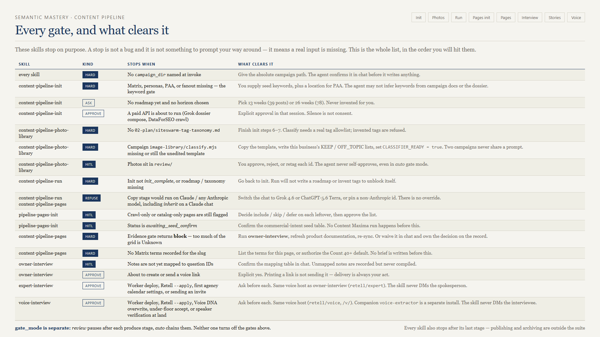
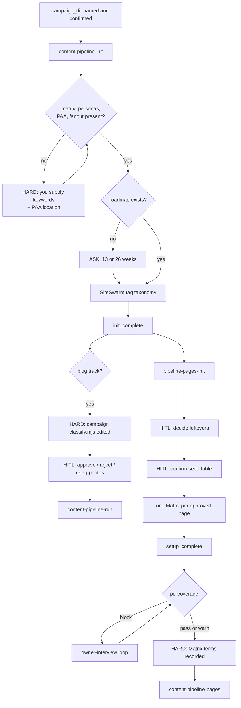

# 01 — Sequencing and gates

A stop is not a failure. It means an input a human owes the process has not arrived yet. Learn the stops and the suite stops feeling temperamental.

## Four kinds of stop

| Kind | Meaning | How you clear it |
|------|---------|------------------|
| **hard** | A required file or status is missing | Produce the file. The agent may not fabricate it. |
| **ask** | A decision only you can make | Answer the question |
| **approve** | Money or an outbound message is about to happen | Say yes explicitly |
| **HITL** | A judgment call the agent must never make for you | Do the review |

`gate_mode` is a separate axis. `review` versus `auto` changes whether produce stages pause between each other. It does not disable anything above.

## The dependency chain

## Gate by gate

### Universal — the campaign pin

Every one of the eight skills requires an explicit `campaign_dir` at invoke and confirms the absolute path in chat before it writes. There is no "use the last campaign" behavior, on purpose. Two campaigns open in two chats must never bleed into each other.

### content-pipeline-init

**Keyword gate — hard.** If any of `matrix`, `personas`, `paa`, or `fanout` is missing, init stops and asks you for seed keywords, plus a location for PAA. It is explicitly forbidden from reading keywords out of the campaign context file, the dossier, or an audit. Guessed keywords produce a roadmap nobody wanted.

**Horizon — ask.** First roadmap only: 13 weeks (39 posts) or 26 weeks (78). Recorded on the manifest as `plan.horizon_weeks`.

**Paid APIs — approve.** A Grok dossier compose or a DataForSEO crawl costs money, so it needs an explicit yes in that session. Approving once does not approve the next one.

**Taxonomy — hard for what comes next.** `init_complete` requires `02-plan/editorial-roadmap.md` **and** `02-plan/siteswarm-tag-taxonomy.md`. The taxonomy is part of init because the photo classifier needs a real tag allowlist before it can sort a single photo.

### content-pipeline-photo-library

**Taxonomy — hard.** No `siteswarm-tag-taxonomy.md`, no classify. Finish init steps 6 and 7.

**Campaign classifier — hard.** Every campaign owns its own `01-resources/image-library/classify.mjs`, copied from the template and edited with this business's KEEP and OFF_TOPIC lists, with `CLASSIFIER_READY = true`. An unedited template hard-stops. Two campaigns sharing one classify prompt is how a tree service ends up with a roofing company's photos.

**HITL — you approve every photo.** The agent runs the script; it never decides. This holds even when `content-pipeline-run` was invoked with `gate_mode=auto`.

**Login walls — stop that source.** If Facebook or Instagram shows a login wall, that source stops. Nobody asks the client for a password.

### content-pipeline-run

**Init gate — hard.** Requires `init_complete`, all eight resource classes plus `ai-isms.md` in `01-resources/`, and both `02-plan/` files. Missing anything sends you back to init. Run will not write a roadmap to unblock itself.

**Model — refuse.** Copy stages will not run on Anthropic, including `inherit` on a Claude chat. No override exists.

**One slot per invoke.** After images, the slot is complete and the skill stops. Another post is another invoke.

**Stop after images — hard.** No `04-publish/`, no `05-archives/`, no CMS.

### pipeline-pages-init

**Resources — hard.** Needs `01-resources/onpage-crawl-*.csv` and `Product-Documentation.md`.

**Reconcile — HITL.** Crawl-only and catalog-only pages stay flagged until you say include, skip, or defer.

**Seed table — HITL.** Status sits at `awaiting_seed_confirm` until you approve the seeds. Nothing calls Content Maxima before that, because Matrix runs cost time and hit a real login.

**Playwright or login block — report, do not substitute.** A hand-built fake Matrix is worse than no Matrix.

### content-pipeline-pages

**Setup gate — hard.** `setup.status = setup_complete` and a Matrix for this slug.

**Evidence gate — hard, and the important one.** `pd-coverage.mjs` runs *before* a run row exists.

| Result | Meaning | Effect |
|--------|---------|--------|
| `pass` | Enough first-party truth | Continue |
| `warn` | Thin but workable | Continue; the brief flags gaps |
| `block` | Too many Unknown / Unverified / Conflict fields | Stop. No run row. |

On block you either run `owner-interview` or waive it in chat. A waiver is persisted with your name.

**Matrix terms — hard.** No brief until `runs[slug].matrix_terms` is non-empty. Either list the terms or authorize the Count 40+ default.

**Model — refuse.** Same Anthropic refusal.

### owner-interview

**Mapping — HITL.** You confirm the question-ID-to-note mapping before any answer is written. Unmapped notes are preserved in the record and never compiled.

**Compile — stops and hands off.** This skill writes a tagged refresh plan; `product-documentation` owns the overwrite and you confirm it.

**Voice links — approve.** Explicit yes before a link is created, and printing a link is not sending it.

### expert-interview

**Not a pages gate.** A blocked slug still needs owner-interview. This skill runs after PD exists, on a cadence.

**Deploy / `--apply` / first agency settings / calendar send — approve.** Ask before each. The skill never DMs the spokesperson.

**Flags — HITL.** Entries land without approval; flagged and internal rows stay out of the digest until you clear them. `pd_candidate` is a handoff, not a PD write.

### voice-interview

**Not a pages gate, not a story bank.** Run it when you want a spoken-source Voice DNA for draft. Owner-interview when pages block; expert-interview after PD, on a calendar.

**Deploy / `--apply` / Voice DNA overwrite / under-floor accept / speaker verification — approve.** Ask before each. The skill never DMs the interviewee.

**Companion.** `--prepare` then `voice-extractor` (separate install). `--land` is the only write into `01-resources/`.

## Resume after a context reset

Every skill is resumable because progress lives in a manifest, not in the conversation.

| Skill | Ask it for | It reads |
|-------|-----------|----------|
| init | "re-inventory and continue" | `content-pipeline-init-manifest.json` |
| photo-library | "what is pending review" | `library-manifest.json`, `review-queue.md` |
| run | "status" | `content-pipeline-run-manifest.json` → `next_action` |
| pages-init | "next matrix" | `pipeline-pages-manifest.json` |
| pages | "status for slug X" | same manifest, `runs[slug]` |
| owner-interview | "list flagged" | the interview record JSON |
| expert-interview | "status" / "list flags" | the series JSON + story bank |
| voice-interview | "status" / "list" | the voice record JSON + landed `*voice-dna*` |

`status:` prefixed statuses tell you exactly what is owed: `init_partial`, `awaiting_horizon`, `awaiting_plan`, `awaiting_taxonomy`, `awaiting_seed_confirm`, `awaiting_approval`, `await_external:write`, `blocked:need_init_plan`.

## The one anti-pattern to name out loud

Do not talk a skill past a gate.

"Just use your best guess for the keywords." "Approve all the photos." "Skip the interview, write it anyway." Each of those produces output that looks finished and is not defensible. If a gate is genuinely wrong for your situation, the supported move is the explicit waiver — which leaves a record — not a persuasive prompt.

## Next

[02-init.md](02-init.md) — the foundation skill in detail.
