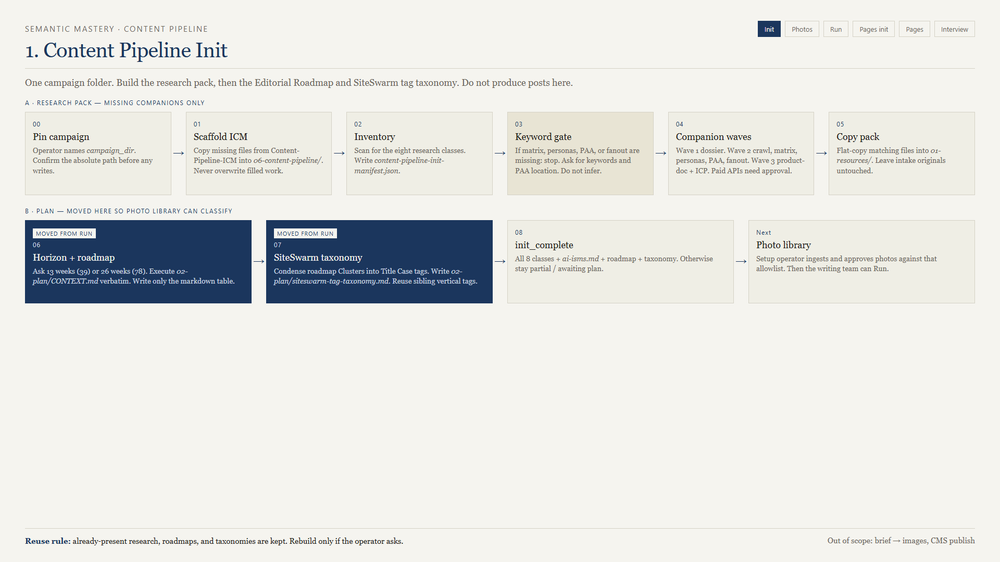
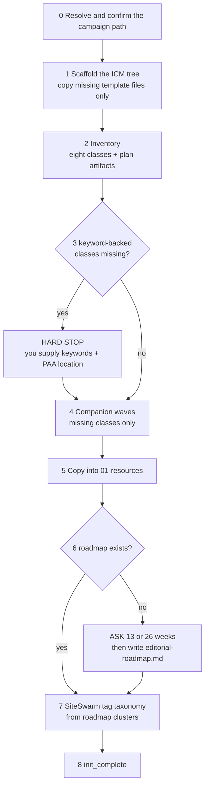

# 02 — content-pipeline-init



**Version 1.1.0. Run once per campaign. Both tracks are blocked until it finishes.**

## What it is for

Build the research pack and the plan, in one place, so nothing downstream has to guess. Init does not do research itself — it inventories what exists, dispatches the companion skills that own each kind of research, copies the results into one folder, and then writes the two planning artifacts it *does* own.

## The eight resource classes

| Class | Companion skill | What it answers |
|-------|-----------------|-----------------|
| `dossier` | `business-dossier` | Who is this business, where, what do they sell |
| `onpage` | `dataforseo-onpage-crawl` | What does the site actually publish today |
| `matrix` | Content Maxima (Matrix) | Which terms the algorithms associate with this service |
| `personas` | Content Maxima (Personas) | Who is searching, and in what language |
| `paa` | `dataforseo-paa-queries` | The questions people actually ask |
| `fanout` | `dataforseo-fanout-queries` | The long-tail expansion around a seed |
| `product_doc` | `product-documentation` | How this business delivers, with an evidence grid |
| `icp` | `customer-research` | The ideal customer profile |

Plus `ai-isms.md`, the campaign's banned-phrase list, which every writing stage reads.

`init_complete` requires all eight present as real, non-empty files, plus `ai-isms.md`, plus both `02-plan/` artifacts. Anything you cannot run through a companion, supply by hand — init only checks that the right file landed in the right place.

## The eight steps



### Waves, and why they exist

| Wave | Classes | Why it waits |
|------|---------|--------------|
| 1 | `dossier` | The crawl needs a domain, and the domain comes from the dossier |
| 2 | `onpage`, `matrix`, `personas`, `paa`, `fanout` | All parallel. All need your keywords (PAA also needs a location). |
| 3 | `product_doc`, `icp` | `product-documentation` hard-gates on dossier plus crawl being on disk |

Within a wave, run them in parallel if your host supports subagents. Between waves, wait. Wave 2 does not start until wave 1 is `complete` or explicitly `skipped` with a domain-bearing dossier already present.

### The keyword gate is the one people fight

If `matrix`, `personas`, `paa`, or `fanout` is missing, init stops and asks you for seed keywords. It is explicitly forbidden from inferring them from the campaign context file, the dossier, or an audit.

That looks pedantic until you watch it happen: an inferred keyword set produces a 39-row roadmap built on terms the client does not sell. You find out in week six.

Bring two to five seed keywords and a PAA location before you start.

### Horizon

First roadmap only:

| Choice | Posts | When |
|--------|-------|------|
| 13 weeks | 39 | Your first campaign, or a trial engagement |
| 26 weeks | 78 | A committed annual program |

Recorded as `plan.horizon_weeks`. Never invented for you.

### The taxonomy is not optional

`02-plan/siteswarm-tag-taxonomy.md` is derived from the roadmap's `Cluster` column:

```bash
node scripts/extract-roadmap-clusters.mjs --campaign-dir "/abs/campaign"
```

It exists in init, not later, because the photo classifier needs a real tag allowlist before it can sort one photo. A missing SiteSwarm site is not a blocker — write the taxonomy file anyway.

## Scripts

```bash
node scripts/scaffold-icm.mjs --campaign-dir "/abs/campaign" --template "/abs/Content-Pipeline-ICM"
node scripts/inventory-resources.mjs --campaign-dir "/abs/campaign" --write-manifest
node scripts/sync-resources.mjs --campaign-dir "/abs/campaign"
node scripts/extract-roadmap-clusters.mjs --campaign-dir "/abs/campaign"
```

`sync-resources.mjs` is the one you will reach for again later — `owner-interview` uses it to re-sync a refreshed `Product-Documentation.md` after an interview.

## Copy, do not rewrite

Resources are **copied** into `01-resources/`. The originals in `01-intake/` or `outputs/` are never edited. Two consequences worth knowing:

- The dossier `.md` is copied; the `.docx` is not. `01-resources/` is the agent pack, and a Word file is not an agent input.
- When you later refresh product documentation, the canonical file in `01-intake/1.1-docs/` changes and the `01-resources/` copy goes stale until you re-sync. `sync-resources.mjs` reports `copied` or `skipped: identical_dest` — read that, not the exit code.

## Statuses you will see

| Status | Meaning | Next move |
|--------|---------|-----------|
| `init_partial` | Resource gaps remain | Re-inventory, dispatch only what is still missing |
| `awaiting_horizon` | Resources fine, no horizon picked | Answer 13 or 26 |
| `awaiting_plan` | Horizon picked, roadmap not written | Resume at step 6 |
| `awaiting_taxonomy` | Roadmap exists, taxonomy missing | Resume at step 7 |
| `init_complete` | Everything present | Photo library, then run — or the pages track |

## Resume

Ask it to re-inventory and continue. It reads the manifest, dispatches only still-missing classes, and re-applies the keyword gate if keyword-backed classes are still absent.

One legacy case worth knowing: an old campaign marked `init_complete` with no roadmap or taxonomy (from a pre-1.1 run). Finish steps 6 and 7 before you touch the photo library.

## Common failures

| Symptom | Cause | Fix |
|---------|-------|-----|
| "template not found" | No `--template`, no env var, no discoverable folder | Pass `--template` with the absolute path to `Content-Pipeline-ICM` |
| Class shows missing but the file is there | Basename does not match the expected pattern | Check `references/resource-patterns.md` and rename |
| ICP not detected | Filename has no `icp` in it | Rename so the basename contains `icp` |
| Roadmap rebuilt when you did not ask | Someone asked for a rebuild, or the cluster set changed | Reuse is the default; only ask for a rebuild deliberately |
| Init "finished" but run still hard-stops | Taxonomy missing | Step 7 |

## Next

Blog track: [03-photo-library.md](03-photo-library.md). Pages track: [05-pages-init.md](05-pages-init.md).
