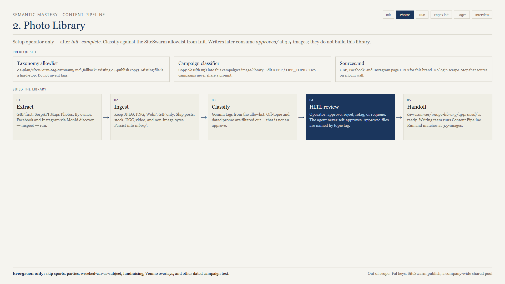
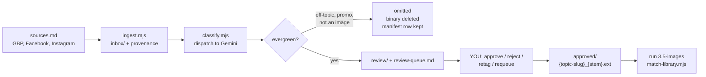

# 03 — content-pipeline-photo-library



**Version 1.8.0. Setup work, not writing work. Blog track only.**

## What it is for

Give writers a folder of real, on-brand, evergreen photos of this business so blog posts illustrate with the client's actual work instead of generated images. Stage 3.5 of the blog produce chain copies from `approved/` first and only generates on a miss.

## Who runs it and when

The **setup operator**, immediately after init reports `init_complete` — before the campaign is handed to writers.

This is a real operational rule, not a preference. Photo HITL is a hundred small judgment calls. Dropping it on a writer who is mid-post costs an afternoon and produces worse decisions.

## The pipeline



## Two hard gates before anything classifies

### The taxonomy

`02-plan/siteswarm-tag-taxonomy.md` must exist. It is the tag allowlist. No allowlist, no classify — and the skill will not invent tags to keep moving.

### The campaign classifier

`{pipeline_dir}/01-resources/image-library/classify.mjs` is **owned by the campaign**, not by the skill. Copy it from `templates/classify.mjs`, write this business's `KEEP` and `OFF_TOPIC` lists, and set `CLASSIFIER_READY = true`.

A missing file or an unedited template hard-stops. This is the single most important design decision in the skill: business judgment lives in the campaign folder, never in shared code. One tree service's "keep this" is a landscaper's off-topic.

What belongs in `OFF_TOPIC` for almost every local business: sports team sponsorships, holiday parties, fundraising graphics, donate or Venmo overlays, a wrecked car as the subject, anything with dated campaign text baked into the image.

## Sources

`{pipeline_dir}/01-resources/image-library/sources.md` lists the GBP, Facebook, and Instagram targets. Missing `sources.md` hard-stops ingest.

**Google Business Profile has a dedicated path.** Run `scripts/gbp-serpapi-owner.mjs` — SerpAPI Maps Photos, category **By owner**. Do not start GBP with a generic Maps image scrape: those return interface chrome, a single thumbnail, or photos taken by customers of something else entirely.

```bash
node scripts/gbp-serpapi-owner.mjs --campaign-dir "/abs/campaign" --q "Brand Name"
```

**Facebook and Instagram** go through a scraper actor — discover, inspect, then run, per `references/scraper-routing.md`.

**A login wall stops that source.** You do not ask a client for their Facebook password. Note it and move on with what you have.

Only JPEG, PNG, WebP, and GIF are persisted, verified by magic bytes. HTML error pages and video payloads never become `.bin` files in the library.

## Classify

```bash
node scripts/classify.mjs --campaign-dir "/abs/campaign"
```

Needs `GEMINI_API_KEY`. Default model `gemini-2.5-flash`, override with `PHOTO_LIBRARY_GEMINI_MODEL`.

That command only dispatches. The prompt it sends is your campaign `classify.mjs`.

Three outcomes:

| Outcome | What happens |
|---------|--------------|
| Evergreen candidate | Moves to `review/`, listed in `review-queue.md` |
| Off-topic / ephemeral promo / not an image | Omitted. Binary deleted, manifest row kept as `rejected`. |
| — | Classify can never set `approved`. Only you can. |

That omission is a **filter, not an approval**. Nothing reaches `approved/` without a human.

County and location tags come from the caption and a city map, not from the model guessing at foliage.

## Human review

```bash
node scripts/apply-review.mjs --campaign-dir "/abs/campaign" --approve ig_123
node scripts/apply-review.mjs --campaign-dir "/abs/campaign" --reject fb_456
node scripts/apply-review.mjs --campaign-dir "/abs/campaign" --retag ig_789 --tags "Tree Pruning, Summit County"
node scripts/apply-review.mjs --campaign-dir "/abs/campaign" --requeue gbp_321
```

| Action | Effect |
|--------|--------|
| approve | `review/` → `approved/`, keeps proposed tags |
| retag | Same move, but your tags override the proposed ones |
| reject | Deletes the binary, keeps the manifest row so ingest never re-downloads it |
| requeue | Forgets the hold so a future ingest may refetch — it cannot restore deleted bytes |

Approved files are renamed `{topic-slug}_{unique-stem}{ext}`, for example `tree-pruning_facebook_122120562308149608.jpg`. County tags stay on the manifest for matching; they are not part of the filename.

Two maintenance flags: `--relabel-approved` backfills names on an older library, `--purge-rejected` clears leftover files.

**After a context reset**, pending ids are in `library-manifest.json` with `status=review`, and in `review-queue.md`. If the markdown got lost, `--rewrite-queue` regenerates it.

## Handoff to writers

The skill seeds campaign-local copies of the helper scripts so writers never need to resolve a skills folder path:

```text
{pipeline_dir}/scripts/
  match-library.mjs     the matcher writers run at 3.5
  fal-generate.mjs      copied when content-pipeline-run is installed alongside
  README.md
```

```bash
node scripts/seed-helpers.mjs --campaign-dir "/abs/campaign"
node scripts/check-helpers.mjs --campaign-dir "/abs/campaign"
```

`check-helpers.mjs` prints the campaign helper paths and the approved-photo count. That is the one-line answer to "is this campaign ready for writers."

## What "empty approved" means

It means stage 3.5 generates with Fal instead of copying. That is all. It is **not** a hard stop, and it is **not** a signal for the writer to start ingesting photos.

If a writer tells you they are blocked because the library is empty, they have misread the contract.

## Common failures

| Symptom | Cause | Fix |
|---------|-------|-----|
| classify hard-stops | Campaign `classify.mjs` missing or `CLASSIFIER_READY = false` | Copy the template, edit KEEP/OFF_TOPIC, flip the flag |
| classify hard-stops with the file present | No `siteswarm-tag-taxonomy.md` | Init steps 6–7 |
| GBP returns junk | Generic Maps scrape instead of the By-owner path | Use `gbp-serpapi-owner.mjs` |
| `.bin` files appear | Non-image payload persisted | Should not happen in 1.8.0; check magic-byte validation |
| Sponsorship and party photos in review | `OFF_TOPIC` list is too thin | Add them to the campaign classifier |
| Writers cannot find the matcher | Campaign `scripts/` not seeded | `node scripts/seed-helpers.mjs --campaign-dir "…"` |
| Photos are on-topic but wrong tags | Model proposal, not gospel | `--retag` with allowlist tags |

## Out of scope

Fal configuration, SiteSwarm publishing, roadmap or taxonomy work, produce stages, auto-approval, and a shared company-wide photo pool. `01-intake/1.4-photos/` remains the marketing dump — this library is not a DAM.

## Next

[04-run.md](04-run.md) — producing a blog post from the library and the roadmap.
