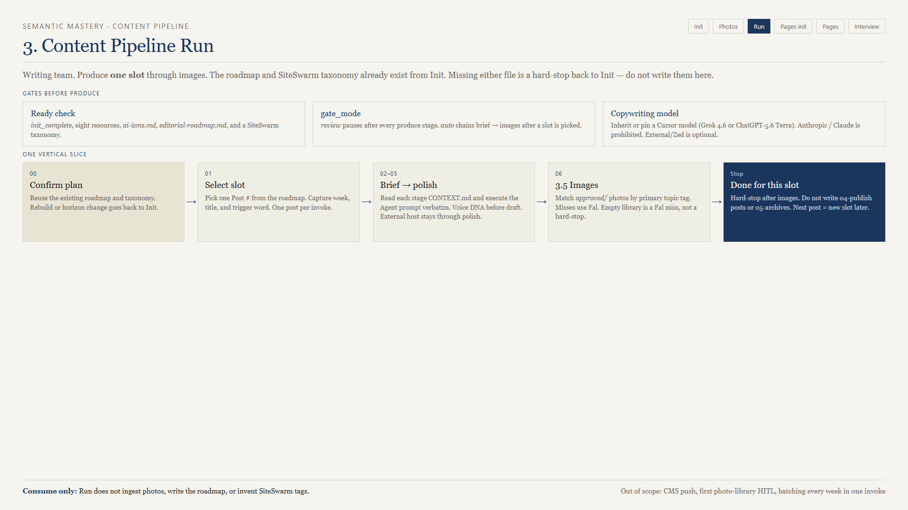
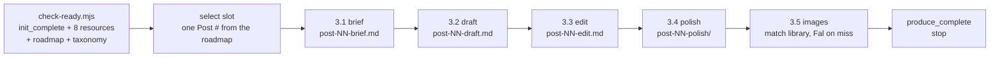

# 04 — content-pipeline-run



**Version 1.5.0. The blog produce skill. One roadmap slot per invoke.**

## What it is for

Take one row from the editorial roadmap and carry it to a finished post with images. The plan already exists; this skill consumes it.

## The five stages



| Stage | Folder | Produces |
|-------|--------|----------|
| brief | `03-write/3.1-brief/` | Structured content brief from one roadmap row |
| draft | `03-write/3.2-draft/` | Heuristic Summary + article draft |
| edit | `03-write/3.3-edit/` | Editorial Log + revised article |
| polish | `03-write/3.4-polish/` | Technical Suite + final publication asset |
| images | `03-write/3.5-images/` | Image manifest + PNGs |

Every stage works the same way: read that folder's `CONTEXT.md`, execute the Agent prompt **verbatim**, write only that stage's named artifact. The prose instruction lives in the campaign folder, which is why you can improve a stage prompt for one client without touching the skill.

## Before it will write anything

```bash
node scripts/check-ready.mjs --campaign-dir "/abs/campaign"
```

Requires `init_complete`, all eight resource classes, `ai-isms.md`, `02-plan/editorial-roadmap.md`, and `02-plan/siteswarm-tag-taxonomy.md`. Anything missing sends you back to init. Run will not write a roadmap to unblock itself.

If `{Company}-expert-interview-series.json` exists, check-ready and `--set-slot` also refresh the story bank. A missing `expert-interview` skill is a warning, not a hard stop. The brief may list `Story bank entries used:`; skip the digest if there isn't one.

Then two invoke-time questions, asked once and stored on the manifest:

**`gate_mode`** — `review` pauses after every stage with `awaiting_approval`; `auto` chains brief through images once a slot is picked. Use `review` on a new campaign until you trust the output.

**`copywriting_model`** — see [08-shared-contracts.md](08-shared-contracts.md). Anthropic is refused.

## Selecting the slot

```bash
node scripts/advance-run.mjs --campaign-dir "/abs/campaign" \
  --set-slot --post 7 --week 3 --title "..." --trigger "..."
```

One post per invoke. After images, the slot is `produce_complete` and the skill stops. Another post is another invoke — deliberately, because batching a whole roadmap in one session degrades every post after the third.

## Voice DNA, resolved before the draft

The 0 / 1 / 2+ rule below is the **consumer**. The producer is [07c-voice-interview.md](07c-voice-interview.md): mint a `/v/` link, pull the transcript, run companion `voice-extractor`, land `{author}-voice-dna.json` in `01-resources/`. A missing file never blocks produce — you get default professional.

The skill scans `01-resources/` for `*voice-dna*`, `*voice_dna*`, `*brand-voice*`, or `*author-voice*` files.

| Files found | What happens |
|-------------|--------------|
| 0 | Default clean professional tone. Recorded as `none — default professional`. |
| 1 | Read it, write in that voice, no question asked |
| 2 or more | **Stop and ask** which one is the author voice. No guessing, no blending. |

`gate_mode=auto` does not skip the two-file question. Even in the selected voice, `ai-isms.md` and the no-em-dash rule still apply.

## Images, and the library contract

Stage 3.5 runs two campaign-local helpers seeded by the photo-library skill:

```text
{pipeline_dir}/scripts/match-library.mjs    copy approved photos by tag
{pipeline_dir}/scripts/fal-generate.mjs     generate on a miss
```

Matching rules: the post's primary topic tag is required, a county tag is a bonus, no photo is reused twice within one post. A miss goes to Fal (`fal-ai/flux-2-pro`, needs `FAL_AI_API_KEY` or `FAL_KEY`).

Three rules people get wrong:

- **An empty library is a Fal miss, not a hard stop.** Do not start photo ingest from inside a produce run.
- **Fal images are outcome and feeling stills**, not mid-job process shots or physics demonstrations.
- **Do not overwrite existing `post-01-img-*.png`.** Ask before replacing images someone approved.

If the campaign helpers are missing, run photo-library's `seed-helpers.mjs`. Do not tell a writer they are blocked because they cannot resolve a skills-folder path.

## Slug convention at polish

Short and essence-first, roughly three to five kebab-case words. No city, brand, or service-category tail.

Good: `hazardous-tree-over-garage`  
Bad: `hazardous-tree-over-garage-denver-emergency-tree-service`

## Writing copy somewhere else

If your copy model lives outside your agent host — a local model in Zed, for example — set `copywriting_via=external`:

```bash
node scripts/advance-run.mjs --campaign-dir "..." \
  --set-copywriting-model "your-local-model" --set-copywriting-via external --set-copywriting-host zed
node scripts/advance-run.mjs --campaign-dir "..." --await-external write
```

**It is one stay, not four round trips.** You complete brief through polish in the external host and come back once, at images. On a small local model, use a new agent thread per stage so its context window stays on that stage prompt. When you return:

```bash
node scripts/advance-run.mjs --campaign-dir "..." --ingest-external-write
```

Most people never need this. Session mode with a good non-Anthropic model is simpler.

## Resume

```bash
node scripts/status-run.mjs --campaign-dir "/abs/campaign"
```

`next_action` tells you exactly where you are:

| `next_action` | Meaning |
|---------------|---------|
| `select_slot` | Ready, no post chosen |
| `run:{stage}` | Do that stage next |
| `await_approval:{stage}` | `review` mode, waiting on your OK |
| `await_external:write` | Handed off to an external host, waiting for polish |
| `blocked:need_init_plan` | Roadmap or taxonomy missing — go back to init |
| `produce_complete` | Slot done |

Completed stages are not redone unless you ask for a rewrite. Approval words the skill accepts: OK, approve, proceed, continue, looks good, next. Revision words: revise, redo, rewrite, or any specific feedback.

## Common failures

| Symptom | Cause | Fix |
|---------|-------|-----|
| Hard stop on invoke | `check-ready` failed | Read its JSON; it names the missing class |
| `blocked:need_init_plan` | Roadmap or taxonomy missing | Init steps 6–7 |
| Refuses to write copy | Chat is Claude, or the stored pin is Anthropic | Switch model, or re-pin non-Anthropic |
| Stuck at `await_approval` | `review` mode | Say OK, or switch to `auto` for later stages |
| Images look like process shots | Fal prompt drifted from outcome stills | Re-read the 3.5 CONTEXT prompt |
| No photos matched | No approved photo carries the post's primary topic tag | Expected. Fal handles it. |
| Wants to write `04-publish/` | Someone asked it to publish | Out of scope. Stop after images. |

## Out of scope

Resource init, paid research calls, roadmap or taxonomy creation, publishing, archiving, and building the photo library.

## Next

[05-pages-init.md](05-pages-init.md) — the same foundation, the other track.
