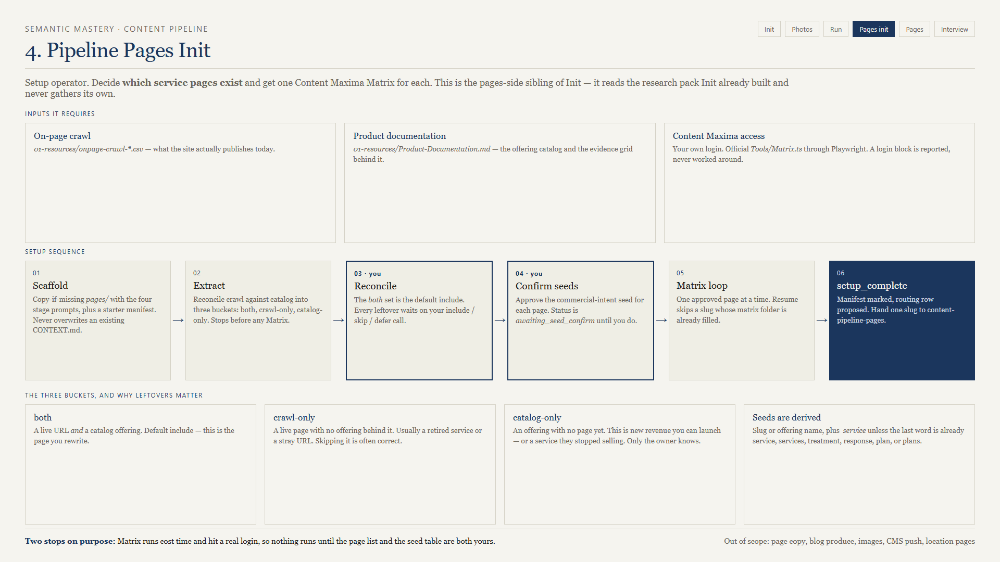
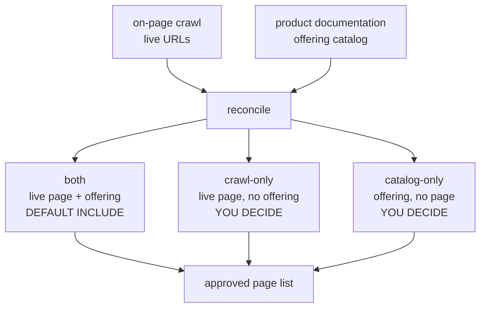

# 05 — pipeline-pages-init



**Version 1.0.0. Setup for the service page track. The pages-side sibling of init.**

## What it is for

Answer one question with evidence rather than assumption: **which service pages should this campaign have?** Then get one Content Maxima Matrix for each of them.

It reads the research pack init already built. It never gathers its own.

## What it needs from init

| File | Why |
|------|-----|
| `01-resources/onpage-crawl-*.csv` | What the site actually publishes today |
| `01-resources/Product-Documentation.md` | The offering catalog, and the evidence grid behind each offering |

Plus a Content Maxima account for the Matrix step. The `contentmaxima` skill that drives it ships in this bundle; the subscription does not.

## The three buckets

This is the core idea of the skill. Two lists rarely agree, and the disagreement is where the money is.



| Bucket | What it usually means | Typical call |
|--------|----------------------|--------------|
| **both** | The page you are rewriting | Include |
| **crawl-only** | A retired service, a stray URL, or a page nobody remembers | Often skip |
| **catalog-only** | A service they sell with no page — or one they quietly stopped selling | Ask the client |

A first run on a ten-offering site might sort to **7 both, 1 crawl-only, 2 catalog-only**. Those three leftovers are the conversation that earns the engagement: one page to retire, two pages that do not exist yet for services they actively sell.

The `both` set is the default include. Every leftover stays flagged until you say include, skip, or defer.

## The sequence

```bash
node scripts/scaffold-pages.mjs --campaign-dir "/abs/campaign"
node scripts/extract-pages.mjs  --campaign-dir "/abs/campaign" --write
```

Scaffold is copy-if-missing — it never overwrites an existing campaign `CONTEXT.md`. Extract builds the reconciled table and **stops before any Matrix**.

Then the two human stops:

```bash
# Stop 1 - reconcile
node scripts/pages-manifest.mjs --campaign-dir "/abs/campaign" --decide retired-service skip
node scripts/pages-manifest.mjs --campaign-dir "/abs/campaign" --decide land-clearing defer
node scripts/pages-manifest.mjs --campaign-dir "/abs/campaign" --approve-list --write-projection

# Stop 2 - seeds
node scripts/pages-manifest.mjs --campaign-dir "/abs/campaign" --apply-seeds --write-projection
```

Status sits at `awaiting_seed_confirm` until you approve the seed table. Nothing calls Content Maxima before that, because Matrix runs cost time and hit a real login.

## Seeds are derived, not invented

| Source | Rule |
|--------|------|
| Crawl page (has a live URL) | Use the slug words: `tree-removal` → `tree removal` |
| Catalog-only offering | Use the offering name: `Land clearing` → `land clearing` |

Then append ` service` **unless** the last token is already one of `service`, `services`, `treatment`, `response`, `plan`, `plans`.

| Input | Seed |
|-------|------|
| tree removal | tree removal service |
| stump grinding | stump grinding service |
| oak wilt treatment | oak wilt treatment |
| arborist services | arborist services |
| emergency storm response | emergency storm response |

The point is commercial intent. A page about "tree removal service" targets someone ready to buy; a page about "tree removal" competes with encyclopedias.

## The Matrix loop

For each approved page with no Matrix yet:

```bash
node scripts/pages-manifest.mjs --campaign-dir "/abs/campaign" --next-matrix
```

Then from your Content Maxima tooling root, on Windows:

```powershell
cd $env:CONTENT_MAXIMA_SKILL_ROOT
npx --yes tsx Tools/Matrix.ts "<seed>" --output "<campaign>/06-content-pipeline/pages/matrix/<slug>"
```

Record it:

```bash
node scripts/pages-manifest.mjs --campaign-dir "/abs/campaign" \
  --record-matrix emergency-service --matrix-path "<xlsx>" --matrix-status recorded
```

Resume is automatic: a slug whose `matrix/{slug}/` folder already contains a `*_matrix*` file is skipped. You can run this loop across several sessions.

**If Playwright or the login is blocked, report it and stop.** A hand-built substitute Matrix is worse than no Matrix, because the pages skill will treat it as real keyword data. A degraded path is only acceptable when you explicitly accept it.

## Finishing

```bash
node scripts/pages-manifest.mjs --campaign-dir "/abs/campaign" --setup-complete --write-projection
```

The skill then proposes one routing row on `06-content-pipeline/CONTEXT.md`:

`Service page copy → pages/CONTEXT.md`

It appends only after you say OK.

## What it creates

```text
{campaign}/06-content-pipeline/
  pages/
    CONTEXT.md
    p.1-brief/CONTEXT.md
    p.2-draft/CONTEXT.md
    p.3-edit/CONTEXT.md
    p.4-polish/CONTEXT.md
    matrix/{slug}/*_matrix.xlsx
  pipeline-pages-manifest.json
```

The four page stage prompts ship inside this skill's `templates/pages/`. You do not need the blog ICM template for the pages track.

## Common failures

| Symptom | Cause | Fix |
|---------|-------|-----|
| Refuses to start | No crawl or no `Product-Documentation.md` in `01-resources/` | Finish init, or re-sync resources |
| Every page lands in crawl-only | Product documentation has no offering catalog | Fix the PD first; the catalog is the input |
| Seed looks wrong | Slug words are not how anyone says it | `--set-seed` overrides; confirm before Matrix |
| Matrix step hangs | Playwright or Content Maxima login | Report and stop. Do not fake a Matrix. |
| Pages skill still hard-stops | `--setup-complete` never ran | Run it after the Matrix loop |
| Scaffold overwrote a CONTEXT | It does not — copy-if-missing | Check you were not looking at a different campaign |

## Out of scope

Page copy, blog produce, images, CMS push, and location pages.

## Next

[06-pages.md](06-pages.md) — producing one approved slug.
