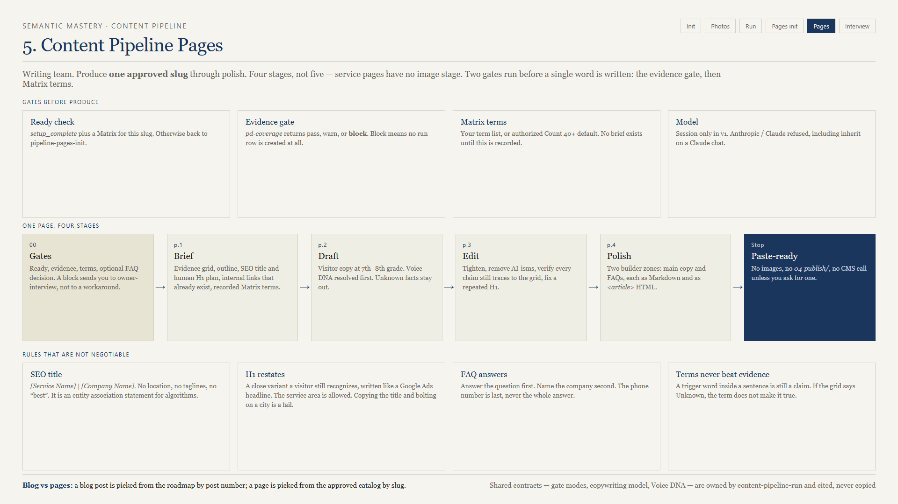
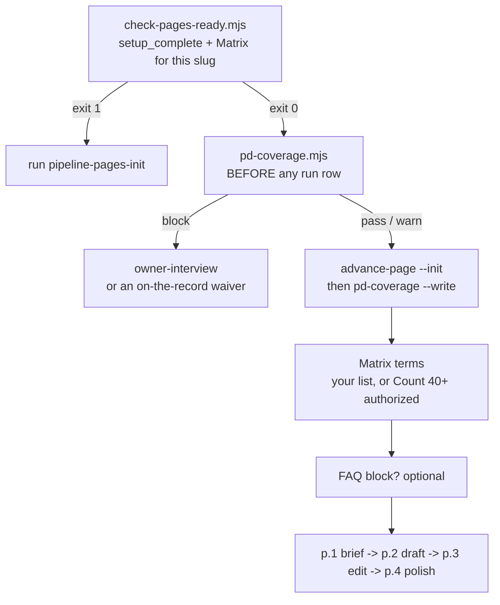

# 06 — content-pipeline-pages



**Version 1.2.2. The service page produce skill. One approved slug per invoke.**

## What it is for

Rewrite or launch one service page: the page a person lands on when they are ready to hire. Four stages, no images, output shaped for a page builder with two content zones.

## How it differs from the blog skill

| | Blog (`content-pipeline-run`) | Pages (this) |
|---|---|---|
| Stages | 5, ending in images | 4, ending in polish |
| Work item | A roadmap slot, by post number | An approved slug |
| Keyword input | Roadmap row: cluster, title, trigger word | Matrix Algorithm Trigger Words |
| Photos | Library, Fal on miss | None |
| Copy host | Session or external/local | Session only in v1 |
| Output | Post markdown + PNGs | Two builder zones, Markdown and HTML |
| Extra gate | — | Evidence gate before anything |

## Three gates, in order



### The evidence gate is the one that matters

`pd-coverage.mjs` runs **before** `advance-page --init`, so a blocked page never gets a run row at all.

| Result | Meaning | Effect |
|--------|---------|--------|
| `pass` | Enough first-party truth to write honestly | Continue |
| `warn` | Thin but workable | Continue; the brief flags the gaps |
| `block` | Too many Unknown / Unverified / Conflict grid rows | Stop |

The block message names `owner-interview` and the scope slug, because that is the actual fix.

Your two honest options: run the interview loop, or waive the block in chat. A waiver persists with your name via `--waive --waived-by <name>`. That is deliberate. Waiving is a business decision someone should be able to look up in six months.

### Matrix terms — no brief before this

```bash
node scripts/extract-matrix-terms.mjs --campaign-dir "/abs/campaign" --slug emergency-service
```

That lists the Algorithm Trigger Words with their Count from the page's Matrix so you can see what the default high-impact set (`Count >= 40`) would be. Then you either list the terms for this page or authorize the default:

```bash
node scripts/advance-page.mjs --campaign-dir "…" --slug emergency-service --set-terms-file terms.txt
node scripts/advance-page.mjs --campaign-dir "…" --slug emergency-service --authorize-default-terms
```

Per-page selection is the better habit. Ask on every slug until you tell the agent to stop asking for this campaign.

Terms belong in H1, H2, H3 where they fit, and sprinkled through body copy where a visitor would actually say them. They never override the evidence grid — **a trigger word inside a sentence is still a claim.** If product documentation says hours, pricing, crane capacity, or insurance is Unknown, a trigger word does not make it known.

### FAQs are optional

Ask once, before or during the brief. If yes, pull People Also Ask through `dataforseo-paa-queries` seeded on the page's commercial seed, with the campaign market as the location. If no, FAQs stay Omit and polish writes `Omit. No FAQ block.` in both formats.

Keep questions that match the offering. Drop off-market locations, legal-advice traps, and trivia. Keep cost questions if they are typical, and answer with how pricing works plus what drives cost — never an invented number.

## The four hardwired copy rules

These are not style preferences. They exist because service pages have two audiences with different needs.

### SEO title — for algorithms

`[Service Name] | [Company Name]`

No location. No taglines. No "best" or "affordable". It is an entity association statement: service entity plus brand entity, nothing else.

| Do | Do not |
|----|--------|
| `Emergency Tree Service \| Ridgeline Tree Care` | `Emergency Tree Service in Greater Denver \| Ridgeline Tree Care` |
| Title Case service name from the offering or seed | Taglines, superlatives, extra modifiers |

### H1 — for humans

**Restate** the service, do not **repeat** it. Write it like a Google Ads headline: relevant and compelling. The service area is allowed here.

| SEO title | Fail (repeat) | Pass (restate) |
|-----------|---------------|----------------|
| `Emergency Tree Service \| Ridgeline Tree Care` | Emergency Tree Service in Greater Denver | 24 Hour Emergency Response Tree Services in Greater Denver |
| `Arborist Services \| Ridgeline Tree Care` | Arborist Services in Greater Denver | Arborist Consultations and Tree Health Assessments in Greater Denver |

The test: strip the company name and the service area from both strings. If what remains is still the SEO service name plus a one-word tack-on like `for`, `Service`, or `Trees`, rewrite it.

### Reading level — 7th to 8th grade

All visitor-facing copy: draft, edit, polish, FAQs, H1, meta description. The SEO title follows the title rule, not grade-level prose.

### FAQ answers — answer first

Answer the question in plain English, then name the company and the next step. **A phone number is not an answer.**

| Fail | Pass |
|------|------|
| Root feeding is the work. Call us. | The best feed depends on the tree and the soil, not one bag for every yard. Ridgeline Tree Care will look at your tree and talk through a free estimate. Call (555) 010-4477. |
| We list it as a named service. Call for a consult. | Not every tree needs it. It helps more when the tree is stressed, the soil is poor, or roots cannot get food from the surface. Call Ridgeline Tree Care and we will start from what you see. |

Cost questions may stay short — no number, free estimate, call. Every other question needs a real first sentence.

## Polish output

Two zones, because a page builder has a top content area and a bottom content area:

| Zone | Contents |
|------|----------|
| Top of page | H1, service sections, CTAs, internal links. **No FAQs.** |
| Bottom of page | FAQs only |

Each zone comes in **both** formats: Markdown for a Markdown-to-HTML builder, and an `<article>` HTML block for a builder that takes HTML. The HTML is an article body only — no `<html>`, `<head>`, `<body>`, no classes, no inline styles.

Package order: Technical Suite, then top zone (Markdown then HTML), then bottom zone (Markdown then HTML), then image suggestions as types and library pointers only.

Nothing is pushed to a CMS unless you ask after polish.

## Where the files land

```text
{campaign}/06-content-pipeline/pages/
  p.1-brief/page-{slug}-brief.md
  p.2-draft/page-{slug}-draft.md
  p.3-edit/page-{slug}-edit.md
  p.4-polish/page-{slug}-polish/page-{slug}-polish.md
```

One slug per invoke. Never writes `03-write/`, `04-publish/`, or `05-archives/`.

## Common failures

| Symptom | Cause | Fix |
|---------|-------|-----|
| Exit 1 on invoke | Setup not complete, or no Matrix for this slug | `pipeline-pages-init` |
| `block` from the evidence gate | Thin first-party evidence | `owner-interview`, or waive on the record |
| Refuses to write copy | Claude chat, or an Anthropic pin | Switch to Grok 4.6 or ChatGPT-5.6 Terra |
| No brief appears | `matrix_terms` never recorded | Set terms or authorize the default |
| H1 fails review | It repeats the title with a city bolted on | Rewrite per the restate test |
| FAQ answers all start with the phone number | Answer-first rule ignored | Rewrite; the phone is last |
| Polish emitted a full HTML document | Article-body-only rule ignored | Re-read the polish output contract |
| Cross-skill citation will not resolve | `content-pipeline-run` is not installed | Install it — it owns the three shared contracts |

## Out of scope

Images, publishing, CMS push, blog produce, location pages.

## Next

[07-owner-interview.md](07-owner-interview.md) — what to do when the evidence gate blocks you.
