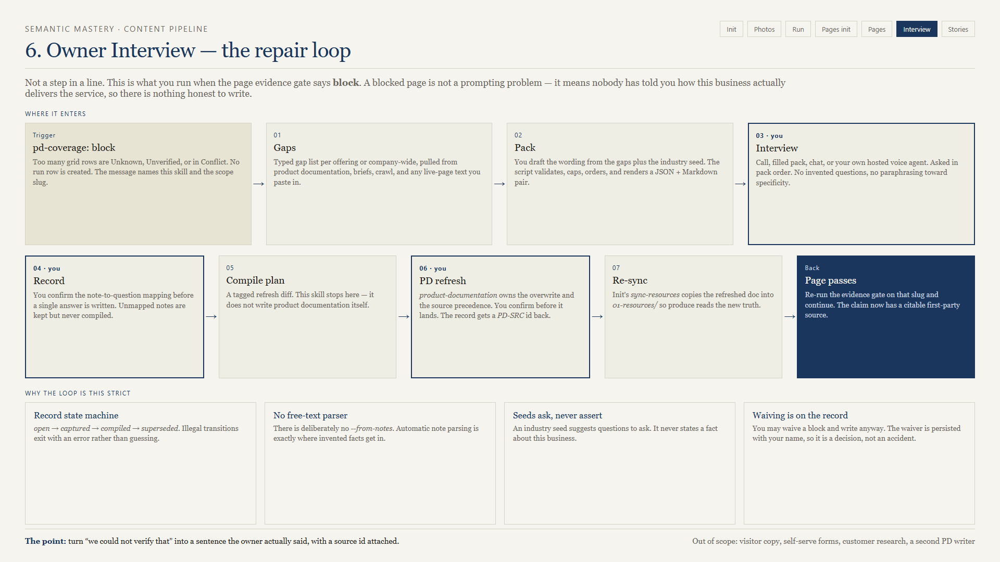
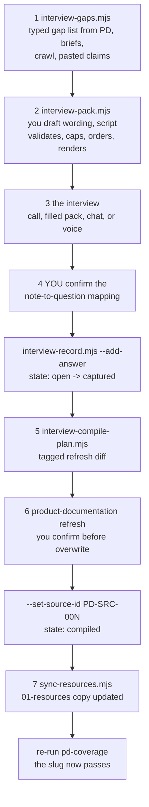

# 07 — owner-interview



**Version 1.2.4. The repair loop. Runs when the page evidence gate says block.**

## What it is for

Turn "we could not verify that" into a sentence the owner actually said, with a source id attached to it.

A blocked page is not a prompting problem. It means nobody has told you how this business delivers this service, so there is nothing honest to write. This skill is how you find out and get it into product documentation.

## When you run it

- `content-pipeline-pages` Step 0b (`pd-coverage.mjs`) returned **block** for a slug
- `product-documentation` finished but the delivery detail is thin
- You are heading into a client call anyway and want the right questions in hand

## The loop



## Three kinds of question

The taxonomy exists because "ask the owner some questions" produces mush. Every question has exactly one type.

| Type | Seeded from | Answer shape |
|------|-------------|--------------|
| **Describe** | An Unknown field, an Open Question, or an Omissions bullet needing a method or process | Free text, plus extracted facts after they speak |
| **Verify** | An Unverified company claim, a Conflict, or text from a live page | `true` / `partly` / `false`, plus a correction when not true |
| **Publish?** | Linked from a Describe or Verify that just produced a sensitive fact | `public` / `framing-only` / `internal` |

A Verify question always quotes the claim and names its source — a live page, company documentation, the crawl, or a named intake file. None of those count as delivery fact until the owner confirms them.

**Owners never hear the word "dossier."** Say "company documentation." The voice host rewrites the word before the agent speaks it.

### The Publish? trigger list

Any question that could produce one of these **must** link to a Publish? question, and the pack script rejects it if it does not:

price, brand, product name, credential, tenure date, vendor, crew size.

That is the difference between "the owner told me their minimum is $450" and "the website says the minimum is $450." A Publish?-linked fact compiled with no decision is stored `internal` and re-asked on the next delta pack.

### The hedge follow-up

Every question carries one scripted follow-up for "it depends." The follow-up asks *what it depends on*. The skill never fills a hedge with an invented specific — that is precisely where a fluent lie enters the record.

### Caps and order

Pack order: delivery → scope → customer expectation → timeline → pricing → verify items.

Caps: 15 questions per offering pack, 12 in the company-wide pack. Long packs do not get answered.

## Running it

```bash
node scripts/interview-gaps.mjs --campaign-dir "/abs/campaign" --scope deep-root-fertilization
node scripts/interview-pack.mjs --campaign-dir "/abs/campaign" --scope deep-root-fertilization --draft draft.json
node scripts/interview-record.mjs --campaign-dir "/abs/campaign" --create --scope deep-root-fertilization
node scripts/interview-record.mjs --campaign-dir "/abs/campaign" --scope deep-root-fertilization --add-answer '<json>'
node scripts/interview-compile-plan.mjs --campaign-dir "/abs/campaign" --scope deep-root-fertilization
```

Scope is an offering slug, or `company` for the company-wide pack. Use `--delta` on the pack when a prior record already exists for that scope.

The agent drafts the question wording — that is a language task. The script owns validation, caps, ordering, and rendering, so a pack is always well-formed.

## Why recording is deliberately slow

| Rule | The failure it prevents |
|------|------------------------|
| You confirm the note-to-question mapping in chat before any answer is written | The agent deciding what the owner meant |
| Unmapped notes go under `## Unmapped notes` and are never compiled | Side commentary silently becoming a published claim |
| There is no `--from-notes` parser | Free-text parsing is exactly where invented facts get in |
| `open → captured → compiled → superseded`, illegal transitions exit 1 | A half-finished interview being treated as a source |
| Compile stops and hands off to `product-documentation` | Two skills fighting over the canonical file |

You will be tempted to want a notes parser. Resist it. The five minutes of mapping is the reason the resulting page is defensible.

## Industry seeds

`references/industry-seeds/tree-care.md` is a worked example, not a limit. Write one seed file per industry you serve.

The rule is absolute: **a seed suggests questions to ask, never a fact to assert.** A tree-care seed may tell you to ask about the fertilization schedule. It may never tell you what the schedule is.

## Compile and re-sync

`interview-compile-plan.mjs` writes a **tagged refresh diff** and stops. Then:

1. Hand the diff to `product-documentation` refresh mode. It owns the precedence rules, including where an owner interview sits relative to a dossier or a crawl.
2. You confirm before the overwrite.
3. Write the assigned source id back: `--set-source-id PD-SRC-00N`. That is what makes the claim traceable later.
4. Re-sync with init's `sync-resources.mjs`, because the produce copy in `01-resources/` is stale until you do.

On re-sync, success is a `copied[]` entry for `class_id: product_doc`, or a `skipped[]` entry with `reason: identical_dest`. **Read that, not the exit code.**

If the refresh is declined, the record stays `captured` and the diff is saved under `{campaign}/04-archives/planning/owner-interview/`.

## Voice is optional

Everything above works with typed notes. If you want the owner to click a link and talk instead, you deploy your own Retell agent and your own Cloudflare Worker — see [09-retell-voice-setup.md](09-retell-voice-setup.md).

Three rules hold either way:

- Voice ends at `captured`, never at `compiled`. Compiling is still your decision.
- The agent stops and waits for an explicit yes before creating a link, and printing a link is not sending it.
- Review `[REVIEW:]` flags per fact with `--list-flagged`. Do not bulk-clear.

## Common failures

| Symptom | Cause | Fix |
|---------|-------|-----|
| `offering_not_found` | Scope slug is not in the catalog | Check the catalog in product documentation |
| `record_exists` | A record already exists on that stem | Use the existing record, or `--delta` for a new pack |
| `publish_link_required` | A price/brand/credential question has no Publish? link | Add the linked Publish? question |
| Illegal state transition | Trying to compile an `open` record | Add answers first |
| Facts appear that the owner never said | Someone skipped the mapping confirmation | Discard, re-map, re-record |
| Re-sync "succeeded" but produce still blocks | You read the exit code, not the `copied[]` entry | Check the JSON |
| PD refresh landed but the page still blocks | Never re-synced `01-resources/` | Run `sync-resources.mjs` |

## Out of scope

Visitor-facing copy, a self-serve intake form, customer research, business-dossier research, and a second product-documentation writer.

## Next

[07b-expert-interview.md](07b-expert-interview.md) — the sibling that captures stories on a cadence. Then [07c-voice-interview.md](07c-voice-interview.md) — how they sound. Then [08-shared-contracts.md](08-shared-contracts.md).
