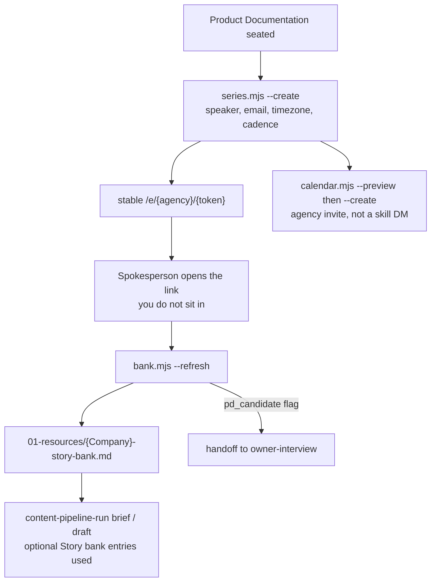

# 07b — expert-interview

**Version 0.1.1. Stories on a cadence. Sibling of owner-interview (facts) and voice-interview (how they sound).**

## Facts vs stories vs voice

| | owner-interview | expert-interview | voice-interview |
|--|-----------------|------------------|-----------------|
| Trigger | `pd-coverage` returned **block** | Product Documentation already exists, and you want recurring first-hand stories | You want a spoken-source Voice DNA for the blog draft |
| What it captures | Citable delivery facts | Lived experience on a calendar | How the spokesperson sounds |
| Where it lands | Product Documentation (through `product-documentation` refresh) | `{Company}-story-bank.md` in `01-resources/` | `{author}-voice-dna.json` in `01-resources/` |
| Who talks | Owner, per offering (or company-wide) | Named spokesperson, one series per campaign | Named spokesperson, one session |
| Voice link | One `/s/{session}` (or `/i/{agency}/{session}`) per pack | One stable `/e/{agency}/{token}` for the series | One `/v/{agency}/{session}` |
| Host | The **same** `voice-host/` Worker | Same Worker, second Retell template (`retell/expert`) | Same Worker, third Retell template (`retell/voice`) |

A `pd_candidate` flag on a story is a **handoff to owner-interview**. It is not a Product Documentation write. Do not compile stories into PD.



## When you run it

- After init has a real `Product-Documentation.md`
- When you want a monthly / biweekly / weekly conversation with the person who does the work
- Not when a service page is blocked — that is [07-owner-interview.md](07-owner-interview.md)

`content-pipeline-run` already knows how to **consume** a digest (brief and draft `CONTEXT.md` have optional `*story-bank*.md` lines). This skill is what **produces** it.

## Create the series

Confirm `campaign_dir`. Then:

```bash
node scripts/series.mjs --campaign-dir "/abs/campaign" --create \
  --speaker "Jordan Hale" --email "jordan@example.com" \
  --timezone America/Denver --cadence monthly --byday 1MO
```

JSON is authoritative: `{campaign}/01-intake/1.1-docs/interviews/expert/{Company}-expert-interview-series.{json,md}`. Every series and every bank entry carries `speaker`.

Cadence is `weekly`, `biweekly`, or `monthly`. `--byday 1MO` means the first Monday.

The script prints a stable `/e/{agency}/{token}` URL. You do not sit in on the call. The spokesperson opens the link; the agent recaps from the **host ledger** (not the local bank) and records stories.

`--rotate-link` issues a new token and 404s the old one. `--pause` / `--resume` / `--end` / `--set-cadence` mark the calendar row `needs_update`.

## Refresh the bank

```bash
node scripts/bank.mjs --campaign-dir "/abs/campaign" --refresh
```

`content-pipeline-run` `check-ready.mjs` and `--set-slot` also run this when a series record exists. A missing skill or a failed refresh is a warning, never a produce blocker.

| Rule | Why |
|------|-----|
| Entries land without approval | The call already happened |
| Flagged / internal / held rows stay out of the digest | Writers must not see what you have not cleared |
| `--list-flags` then `--clear-flag` or `--set-publish` | Review is per entry, not bulk |
| `--clear-flag --pd handoff` | Records a handoff; still not a PD write |

Digest path: `{campaign}/06-content-pipeline/01-resources/{Company}-story-bank.md`.

## Optional use in brief and draft

If the digest exists, the brief may list `Story bank entries used:`. The draft may use **only** those entries. Skip the digest if it is missing. Do not invent a story to fill the line.

A flagged row is not in the digest. If a writer "remembers" one from the call, they are writing unpublished material.

## Calendar (optional)

The skill never emails the spokesperson. The agency Workspace invite does (`sendUpdates=all`).

HITL stops — ask before each:

1. First `{Agency}/agency-settings.json` (`gws_config_dir` under `%LOCALAPPDATA%\gws\{agency-slug}`, not a synced folder)
2. `gws auth login` under that config dir (one login per agency per machine)
3. `calendar.mjs --create` (preview first)

Title form: `{Company} Expert Interview Call for {Agency}`.

OAuth consent must be **Production**. Testing-mode refresh tokens die in seven days. Set `GOOGLE_WORKSPACE_CLI_CLIENT_ID` / `_SECRET` as user env vars.

## Cadence time caps

| Cadence | Soft target | Hard hang-up |
|---------|-------------|----------------|
| Weekly | 10–15 min | 15 |
| Biweekly | 20–30 min | 30 |
| Monthly | 30–45 min | 45 |

The Worker hangs up at the hard cap. Do not edit the expert prompt to "just keep going."

## Voice is the same host

Do not deploy a second Worker. Create a second **Retell agent** on the host you already have:

```bash
node scripts/setup-agent.mjs --template retell/expert --worker-url https://<your-worker> --apply
```

Ask before `--apply` and before a production deploy. Then set `RETELL_EXPERT_AGENT_ID` and `PUBLIC_ORIGIN` on that Worker. Details: [09-retell-voice-setup.md](09-retell-voice-setup.md).

`EXPERT_INTERVIEW_HOST_URL` is optional; the skill falls back to `OWNER_INTERVIEW_HOST_URL`. Same host token.

Notes-only is not the default path here the way it is for owner-interview — the series is a link the spokesperson opens. You can still skip voice entirely and not run this skill.

## Common failures

| Symptom | Cause | Fix |
|---------|-------|-----|
| `campaign_dir_required` | Path not named | Name the absolute campaign path |
| `config_dir_synced` | `gws_config_dir` is OneDrive / SharePoint | Move it under `%LOCALAPPDATA%\gws\{slug}` |
| `gws_client_unset` | OAuth client env vars missing | Set the two `GOOGLE_WORKSPACE_CLI_*` user vars |
| Digest empty after a call | Refresh not run, or every row flagged | `bank.mjs --refresh`, then `--list-flags` |
| Writer used a story you marked internal | They did not read the digest | Digest is the only input; flagged rows are omitted |
| Recap repeats last month's stories | Host ledger was wiped, or you treated the bank as recap | Recap comes from the host, not the local JSON |
| Page still blocked after a great expert call | You captured stories, not delivery facts | Run owner-interview for that slug |

## Out of scope

Visitor-facing copy, Product Documentation writes, DMing the spokesperson, a second voice host, and auto-approving flags.

## Next

[07c-voice-interview.md](07c-voice-interview.md) — the sibling that captures how they sound. Then [08-shared-contracts.md](08-shared-contracts.md). Voice deploy details stay in [09-retell-voice-setup.md](09-retell-voice-setup.md).
