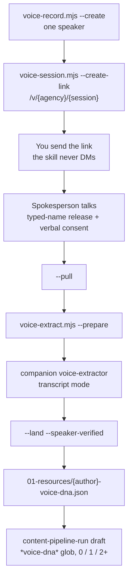

# 07c — voice-interview

**Version 0.1.1. How they sound. Sibling of owner-interview (facts) and expert-interview (stories).**

## Facts vs stories vs voice

| | owner-interview | expert-interview | voice-interview |
|--|-----------------|------------------|-----------------|
| Trigger | `pd-coverage` returned **block** | Product Documentation already exists, on a calendar | You want a spoken-source Voice DNA for the blog draft |
| What it captures | Citable delivery facts | Lived experience | How the spokesperson *sounds* |
| Where it lands | Product Documentation (through `product-documentation`) | `{Company}-story-bank.md` | `{author}-voice-dna.json` in `01-resources/` |
| Who talks | Owner, per offering (or company-wide) | Named spokesperson, one series | Named spokesperson, one session |
| Voice link | One `/s/{session}` (or `/i/{agency}/{session}`) per pack | One stable `/e/{agency}/{token}` | One `/v/{agency}/{session}` |
| Host | The **same** `voice-host/` Worker | Same Worker, `retell/expert` | Same Worker, `retell/voice` |
| Writes copy / facts / stories? | Facts only | Stories only | Neither |

This skill never writes visitor copy, never compiles Product Documentation, and never appends a story-bank row. `pd_candidate` is not a voice-interview concept.



## When you run it

- After init has scaffolded `01-resources/`
- When the draft's 0 / 1 / 2+ rule would otherwise fall through to default professional, and you want a spoken-source profile instead
- Not when a service page is blocked — that is [07-owner-interview.md](07-owner-interview.md)
- Not for recurring stories — that is [07b-expert-interview.md](07b-expert-interview.md)

`content-pipeline-run` already knows how to **consume** a Voice DNA file (`references/voice-dna.md`, `*voice-dna*` glob). This skill is what **produces** it.

## Create, mint, pull

Confirm `campaign_dir`. Then:

```bash
node scripts/voice-record.mjs --campaign-dir "/abs/campaign" --create --speaker "Jordan Hale"
node scripts/voice-session.mjs --campaign-dir "/abs/campaign" --speaker "Jordan Hale" --create-link
```

JSON is authoritative: `{campaign}/01-intake/1.1-docs/interviews/voice/{Company}-voice-interview-{speaker-slug}-{YYYY-MM-DD}.{json,md}`. State: `open → captured → extracted → superseded`. `under_floor` is a flag, not a state.

The script prints a `/v/{agency}/{session}` URL. You send it. A second `--create` for the same speaker supersedes the prior record. Re-minting expires the prior `/v/` link.

```bash
node scripts/voice-session.mjs --campaign-dir "/abs/campaign" --speaker "Jordan Hale" --status
node scripts/voice-session.mjs --campaign-dir "/abs/campaign" --speaker "Jordan Hale" --pull
```

Consent is the verbal authorization at the start of the call, matching the sibling skills. The host page still collects the typed-name release. Pull before the shorter of host expiry + `RETENTION_DAYS` and Retell's own window. Voice links default to `VOICE_LINK_EXPIRY_DAYS` (2), shorter than owner links.

## Extract and land

```bash
node scripts/voice-extract.mjs --campaign-dir "/abs/campaign" --speaker "Jordan Hale" --prepare
```

`--prepare` prints the transcript path and the sibling `voice-extractor` schema path. Run **`voice-extractor`** next. That skill is a companion, like `product-documentation`: install it separately next to this folder. It is not in the suite ZIP.

Then land:

```bash
node scripts/voice-extract.mjs --campaign-dir "/abs/campaign" --speaker "Jordan Hale" \
  --land "/abs/path/to/voice-dna.json" --speaker-verified
```

`--land` validates and writes `{author}-voice-dna.json` into `06-content-pipeline/01-resources/`. HITL stops — ask before each:

| Gate | Why |
|------|-----|
| `--speaker-verified` | A second party holding the URL cannot land the file |
| `--confirm-overwrite` | An existing Voice DNA is not replaced silently |
| `--accept-under-floor` | A short transcript is not treated as a full profile |
| `--accept-content-flags` | Content-screen hits stay visible |

`--retire --speaker <name>` moves the active file out of `01-resources/` so the draft glob stops resolving it.

## What draft does with the file

Unchanged from [04-run.md](04-run.md) and [08-shared-contracts.md](08-shared-contracts.md):

| Files in `01-resources/` matching `*voice-dna*` / `*voice_dna*` / `*brand-voice*` / `*author-voice*` | Draft |
|---|---|
| 0 | Default clean professional. Recorded as `none — default professional`. |
| 1 | Read it, write in that voice, no question |
| 2 or more | **Stop and ask.** No guessing, no blending. |

`gate_mode=auto` does not skip the two-file question. `ai-isms.md` and the no-em-dash rule still apply.

## Voice is the same host

Do not deploy a second or third Worker. Create a third **Retell agent** on the host you already have:

```bash
node scripts/setup-agent.mjs --template retell/voice --worker-url https://<your-worker> --apply
```

Ask before `--apply` and before a production deploy. Then set `RETELL_VOICE_AGENT_ID` on that Worker. Details: [09-retell-voice-setup.md](09-retell-voice-setup.md).

Same env vars as the siblings: `OWNER_INTERVIEW_HOST_URL` + `OWNER_INTERVIEW_HOST_TOKEN`.

Owner notes still work without this host. Voice DNA from a spoken interview does not.

## Common failures

| Symptom | Cause | Fix |
|---------|-------|-----|
| `campaign_dir_required` | Path not named | Name the absolute campaign path |
| URL is `/s/` or `/i/` | Wrong create path or owner agent id on the voice var | Confirm `--create-link` on this skill; `RETELL_VOICE_AGENT_ID` is the voice agent |
| `transcript_pending` | Pulled before Retell finished analysis | Wait; `--status` again. Do not extract a stub |
| `consent_refused` / `consent_withdrawn` | They said no, or withdrew | Do not extract. Confirm deletion before another mint |
| `--land` without `--speaker-verified` | The CLI refused | That is the gate. You confirm the speaker |
| Draft still asks which voice | Two or more matching files | Expected. Pick one, or `--retire` the extra |
| Draft ignores a retired file | Leftover still matches the glob | Confirm the file left `01-resources/` |
| Thought you needed a second Worker | Misread the host chapter | Same `voice-host/`; `--template retell/voice` |

## Out of scope

Visitor-facing copy, Product Documentation writes, story-bank rows, DMing the interviewee, a second voice host, auto-verifying the speaker, and shipping `voice-extractor` inside this folder.

## Next

[08-shared-contracts.md](08-shared-contracts.md) — the rules every produce skill shares, including the Voice DNA 0 / 1 / 2+ consumer. Host deploy details stay in [09-retell-voice-setup.md](09-retell-voice-setup.md).
