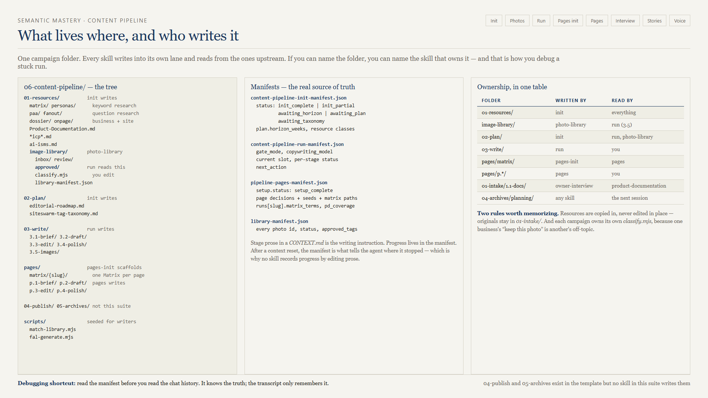

# 08 — Shared contracts

Eight skills, one set of rules. These files are written **once** in `content-pipeline-run/references/` and cited by the pages skills rather than copied. When you learn them, you have learned both tracks.

| Contract | Owner file | Cited by |
|----------|-----------|----------|
| Gate modes | `content-pipeline-run/references/gate-modes.md` | `content-pipeline-pages` |
| Copywriting model | `content-pipeline-run/references/copywriting-model.md` | `content-pipeline-pages` |
| Voice DNA | `content-pipeline-run/references/voice-dna.md` | `content-pipeline-pages` |
| Coverage map | `content-pipeline-pages/references/coverage-map.json` | `owner-interview` |
| Manifest schema | each skill's `references/manifest-schema.md` | its siblings |

This is why you install all eight even for one track. A single definition that both produce skills read cannot drift. Story-bank consumption lives in the ICM brief/draft templates; `expert-interview` is what produces the digest. Voice DNA consumption lives in `voice-dna.md`; `voice-interview` is what produces the file.

## 1. Gate modes

Asked once at first run, stored on the manifest, changeable mid-run for subsequent stages only.

| Mode | Behavior |
|------|----------|
| `review` | After every completed stage: status `awaiting_approval`, stop the turn, wait for your OK |
| `auto` | After the slot or slug is chosen, chain the produce stages without pausing |

`auto` still pauses on missing inputs, errors, and explicit stops. It never turns off a hard gate, and it never lets the agent approve a photo or an interview answer.

Recommended: `review` on a new campaign. Move to `auto` once you trust stage quality on that client.

Words the agent treats as approval: OK, approve, proceed, continue, looks good, next.  
Words it treats as revise: revise, redo, rewrite — or any specific feedback, which re-runs that stage with the feedback applied.

## 2. Copywriting model

Two independent fields, both stored on the manifest:

| Field | Values | Meaning |
|-------|--------|---------|
| `copywriting_model` | `inherit` or a pinned model id | Which model writes the copy |
| `copywriting_via` | `session` or `external` | Where it runs |

### Anthropic is prohibited for copy stages

Claude, Sonnet, Opus, Haiku, any Anthropic id — refused as a pin, refused as `inherit` when the chat itself is Claude, refused as a Task dispatch, and never silently substituted. **Anthropic watermarks generated text.** There is no override flag, and asking nicely does not produce one.

You can orchestrate on any model. Only the stages producing client-facing prose are restricted.

Recommended session models:

| Model | Cursor slug |
|-------|-------------|
| Grok 4.6 | `cursor-grok-4.6-high-fast` |
| ChatGPT-5.6 Terra | `gpt-5.6-terra-medium` |

If you skip the question and the chat is not Anthropic, the skill stores `inherit` + `session`.

If a pinned id is not dispatchable, the skill **stops**. It does not substitute a different model, because silently swapping the copy model invalidates every quality judgment you made on earlier posts.

### External host (blog track only in v1)

`copywriting_via=external` hands brief through polish to another app already connected to your copy model — a local model in Zed, for example.

**One stay, not four round trips.** Complete `3.1` through `3.4` there and return once at `3.5-images`. On a small local model, use a new agent thread per stage so its context window stays on that stage prompt. That is still one stay.

Service pages are session-only in v1.

## 3. Voice DNA

Resolved **before** the draft. Optional — a missing Voice DNA file never blocks produce.

The skill scans `01-resources/` (top level first) for filenames matching `*voice-dna*`, `*voice_dna*`, `*brand-voice*`, or `*author-voice*`, accepting `.json` or `.md`.

| Files found | Action |
|-------------|--------|
| **0** | Default clean professional tone. Recorded as `none — default professional`. |
| **1** | Read it, write in that voice, no question |
| **2 or more** | **Stop and ask** which is the author voice. No guessing, no blending. |

`gate_mode=auto` does not skip the two-file question.

Two rules that survive any voice: `ai-isms.md` still applies, and so does the no-em-dash rule — even if the Voice DNA file itself is full of em dashes. The Heuristic Summary records the voice source path so you can tell later which voice a post was written in.

The skill never invents a Voice DNA file, and never reads intake copies outside `01-resources/` unless you point at them. To **produce** a spoken-source file, run [07c-voice-interview.md](07c-voice-interview.md). Zero files is still a valid produce: default professional.

## 4. The manifest is the source of truth

Every skill records progress in JSON, never in prose.

| Manifest | Owner | Key fields |
|----------|-------|-----------|
| `content-pipeline-init-manifest.json` | init | `status`, `plan.horizon_weeks`, resource classes |
| `content-pipeline-run-manifest.json` | run | `gate_mode`, `copywriting_model`, current slot, per-stage status, `next_action` |
| `pipeline-pages-manifest.json` | pages-init and pages | `setup.status`, page decisions, seeds, matrix paths, `runs[slug].matrix_terms`, `pd_coverage` |
| `library-manifest.json` | photo-library | every photo id, status, `approved_tags` |

The consequence worth internalizing: **prose in a `CONTEXT.md` is an instruction; JSON in a manifest is a fact.** Progress is never recorded by editing prose, which is why every skill resumes cleanly after a context reset and why "read the manifest before you read the chat history" is the fastest debugging move in the suite.

## 5. The campaign pin

Every skill requires an explicit `campaign_dir` at invoke and confirms the absolute path in chat before writing. There is no implicit "current campaign."

Two campaigns in two chats must never bleed together, and the classifier isolation tests in the photo-library skill exist specifically to prove they do not.

## 6. The agent never self-approves

| Decision | Who |
|----------|-----|
| Approve, reject, or retag a photo | You |
| Include, skip, or defer a leftover page | You |
| Confirm the Matrix seed table | You |
| Select or authorize Matrix terms | You |
| Map interview notes to question IDs | You |
| Confirm a product-documentation overwrite | You |
| Waive an evidence block | You, on the record |
| Create or send a voice link | You |
| Overwrite a Voice DNA, accept under-floor, or verify the speaker at land | You |
| Spend money on a paid API | You |

`gate_mode=auto` does not move a single row of that table.

## 7. Copy in, do not edit in place

Research artifacts are **copied** into `01-resources/`. Originals in `01-intake/` and `outputs/` are never edited.

The trade-off: after a product-documentation refresh, the `01-resources/` copy is stale until you re-sync. `sync-resources.mjs` reports `copied` or `skipped: identical_dest` per class — read the JSON, not the exit code.

## 8. Stop at the end of scope

| Skill | Stops after |
|-------|-------------|
| init | `init_complete` |
| photo-library | Handoff, with `approved/` populated |
| run | `3.5-images` |
| pages-init | `setup_complete` |
| pages | `p.4-polish` |
| owner-interview | Compile plan handed off |
| expert-interview | Series live; digest refreshed (calendar invite is optional) |
| voice-interview | Voice DNA landed in `01-resources/` (or retired out of the glob) |

No skill in the suite writes `04-publish/` or `05-archives/`, and none pushes to a CMS unless you ask for it after polish.

## Next

[10-external-dependencies.md](10-external-dependencies.md) — the accounts and keys behind these steps.
