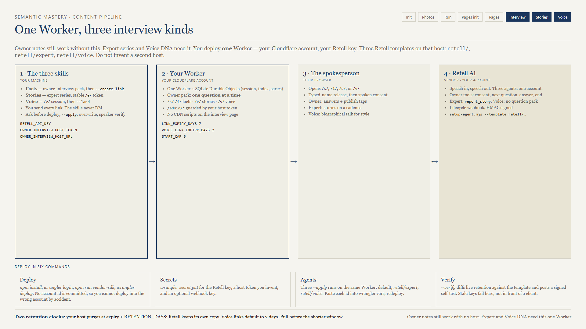
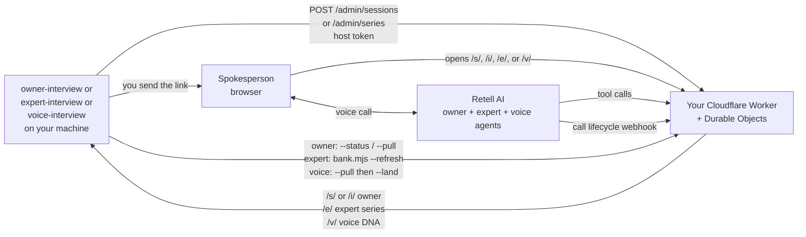

# 09 — Retell AI voice setup (deploy your own)

**Optional for owner-interview** (typed notes still work). **Required for expert-interview series links and voice-interview `/v/` links.** One Worker, three Retell agents. Do not deploy a second or third host.

Nothing in this suite is hosted for you. By the end of this page you will have your own Retell agents on your own Retell account, and your own Cloudflare Worker on your own Cloudflare account.

## What you are building





The important idea for **owner** and **expert** calls: **Retell never decides what to ask.** Your Worker holds the pack (or the series ledger) and hands out the next prompt. That is what keeps those records citable.

**Voice DNA** is the exception that proves the same host: the `/v/` session is a biographical conversation, not a question pack. The third Retell template (`retell/voice`) still lives on this Worker. It does not write copy, facts, or stories — `voice-interview` lands a style file the draft already consumes.

## Costs before you start

| Service | What you pay |
|---------|--------------|
| Cloudflare Workers | Free plan is enough to begin. Durable Objects with SQLite storage are included on the free plan. |
| Retell AI | Per voice minute, plus the underlying model. Check their current pricing page. |
| Domain | Not required. The `*.workers.dev` URL is fine. |

A 30-minute owner interview is a real Retell charge. Test on yourself first.

## Step 1 — Retell account

1. Sign up at Retell AI.
2. Create an API key. Copy it once — you cannot read it again.
3. Note that you do **not** create the agent by hand in their dashboard. The setup script builds it from the template so every student's agent behaves identically.

## Step 2 — Cloudflare + deploy

From the `voice-host/` folder in this package:

```bash
npm install
npx wrangler login
npm run vendor-sdk
npx wrangler deploy
```

`wrangler login` opens a browser. Pick the Cloudflare account you want this to live in. There is deliberately no `account_id` in `wrangler.jsonc` so nobody accidentally deploys into someone else's account.

`vendor-sdk` bundles the pinned Retell browser SDK into `public/retell-client.js`. The interview page loads no third-party script at runtime.

Write down the deployed URL. Everything below calls it `https://<your-worker>`.

## Step 3 — Secrets

```bash
npx wrangler secret put RETELL_API_KEY
npx wrangler secret put OWNER_INTERVIEW_HOST_TOKEN
npx wrangler secret put RETELL_WEBHOOK_KEY
```

| Secret | Required | Where it comes from |
|--------|----------|---------------------|
| `RETELL_API_KEY` | yes | Step 1 |
| `OWNER_INTERVIEW_HOST_TOKEN` | yes | A long random string you invent. This is the password between your skill and your Worker. |
| `RETELL_WEBHOOK_KEY` | optional | Another random string. If you skip it, webhook signatures fall back to `RETELL_API_KEY`. |

Generate a token:

```powershell
[Convert]::ToBase64String((1..48 | ForEach-Object { Get-Random -Max 256 }))
```

## Step 4 — Create the agent(s)

Owner agent (default template):

```bash
node scripts/setup-agent.mjs --worker-url https://<your-worker> --apply
```

Expert agent — **same Worker**, second template. Ask before `--apply`.

```bash
node scripts/setup-agent.mjs --template retell/expert --worker-url https://<your-worker> --apply
```

Voice DNA agent — **same Worker**, third template. Ask before `--apply`.

```bash
node scripts/setup-agent.mjs --template retell/voice --worker-url https://<your-worker> --apply
```

What `--apply` does:

- Reads `retell/agent.json` + `retell/prompt.md`, or `retell/expert/` / `retell/voice/` when `--template` is set
- Substitutes your Worker origin into the webhook URL and the tool URLs
- Attaches your host token as `X-Owner-Interview-Key` on the tool calls
- Creates the Retell LLM, then the agent named `owner-interview`, `expert-interview`, or `voice-interview` — or **updates** them if that name already exists
- Prints `agent_id`, `llm_id`, and `webhook_url`

Run it with no flags at all for a dry run that touches nothing.

## Step 5 — Wire the agent id(s) back and redeploy

Open `wrangler.jsonc`, replace the placeholders:

```jsonc
"vars": {
  "RETELL_AGENT_ID": "agent_...owner id from step 4...",
  "RETELL_EXPERT_AGENT_ID": "agent_...expert id from step 4...",
  "RETELL_VOICE_AGENT_ID": "agent_...voice id from step 4...",
  "PUBLIC_ORIGIN": "https://<your-worker-or-custom-domain>",
  "LINK_EXPIRY_DAYS": "7",
  "VOICE_LINK_EXPIRY_DAYS": "2",
  "RETENTION_DAYS": "30",
  "START_CAP": "5",
  "EXPERT_START_CAP": "8"
}
```

`PUBLIC_ORIGIN` is what gets printed on `/e/{agency}/{token}` series links and `/v/{agency}/{session}` voice links. Use a custom domain if you have one; `*.workers.dev` works for testing. Do not copy someone else's hostname.

Then:

```bash
npx wrangler deploy
```

## Step 6 — Verify before a client ever sees it

Check the Retell dashboard: the agent's webhook should point at `https://<your-worker>/retell/webhook` and the badge should be green.

```bash
node scripts/setup-agent.mjs --worker-url https://<your-worker> --verify
node scripts/setup-agent.mjs --template retell/expert --worker-url https://<your-worker> --verify
node scripts/setup-agent.mjs --template retell/voice --worker-url https://<your-worker> --verify
```

`--verify` does two things: it diffs the live agent's `data_storage_setting` against the template so nobody silently changed retention in the dashboard, and it posts an HMAC-signed self-test to `/retell/selftest`. If your webhook key is stale, this is where you find out — not mid-call with a client's owner.

## Step 7 — Point the skill at your host

Set these as **user environment variables**, not files:

| Variable | Value |
|----------|-------|
| `RETELL_API_KEY` | same key as the Worker |
| `OWNER_INTERVIEW_HOST_TOKEN` | same token as the Worker |
| `OWNER_INTERVIEW_HOST_URL` | `https://<your-worker>` |
| `EXPERT_INTERVIEW_HOST_URL` | optional; falls back to `OWNER_INTERVIEW_HOST_URL` |

On Windows: **System Properties → Environment Variables → User variables**. Restart your agent host afterward so it picks them up.

The skill refuses any non-HTTPS host URL other than `localhost`.

## Step 8 — First real link

```bash
node scripts/interview-voice.mjs --campaign-dir "<abs>" --scope emergency-service --create-link
node scripts/interview-voice.mjs --campaign-dir "<abs>" --scope emergency-service --status
node scripts/interview-voice.mjs --campaign-dir "<abs>" --scope emergency-service --pull
```

Rules the skill enforces, on purpose:

- A pack and an open record must already exist. `--create-link` never creates a record for you.
- The agent stops and waits for your explicit yes before creating a link.
- Printing a link is not sending a link. Sending it to an owner is always your act.

Want every service page in one paste-ready block?

```bash
node scripts/interview-links.mjs --campaign-dir "<abs>"
```

That produces one resumable link **per scope** — not one marathon session — and writes a `{Company}-interview-links-{date}.md` you can paste into an email.

## Step 9 — Review the flags

Voice ends at `captured`, never at `compiled`. Before you compile anything into product documentation:

```bash
node scripts/interview-record.mjs --campaign-dir "<abs>" --scope emergency-service --list-flagged
```

Anything the agent was unsure about is marked `[REVIEW:]`. Clear those deliberately, per fact. Do not bulk-clear.

## Retention — the one thing that bites people

Two clocks run at once:

- **Your host:** purges the session at link expiry + `RETENTION_DAYS` (default 7 + 30).
- **Retell:** keeps its own copy on Retell's retention schedule.

Pull the session before the **shorter** of the two. Once both windows close, the answers are gone and you are asking the owner again.

## Tuning the interviewer

| File | What to change |
|------|----------------|
| `retell/agent.json` | Owner voice id, model, max call duration, silence timeout, `data_storage_setting` |
| `retell/prompt.md` | Owner interviewer rules (pack questions only) |
| `retell/expert/agent.json` | Expert agent name, tools (`report_story`), duration |
| `retell/expert/prompt.md` | Expert interviewer rules (stories, cadence caps) |
| `retell/voice/agent.json` | Voice agent name, duration, storage |
| `retell/voice/prompt.md` | Voice interviewer rules (style-profile disclosure; no question pack) |
| `wrangler.jsonc` vars | Link expiry, `VOICE_LINK_EXPIRY_DAYS`, retention, start caps, `PUBLIC_ORIGIN` |

Re-run `--apply` after editing either Retell file, then `--verify`.

Read `prompt.md` before you change it. Rules like "never invent a question", "do not paraphrase toward specificity", "one optional follow-up if they hedge", and the exact wording for public / framing-only / internal exist so the transcript stays usable as a **citable source**. Loosening them gives you a friendlier agent and a record you cannot defend.

## Troubleshooting

| Symptom | Cause | Fix |
|---------|-------|-----|
| `host_url_insecure` | `OWNER_INTERVIEW_HOST_URL` missing or not HTTPS | Set the full `https://` origin |
| `host_token_unset` (503) | Worker has no `OWNER_INTERVIEW_HOST_TOKEN` | `wrangler secret put`, redeploy |
| `host_auth_failed` (401) | Skill token and Worker token differ | Re-set both to the same value |
| `selftest_401` on `--verify` | Webhook key drift | Rotate `RETELL_WEBHOOK_KEY` on both sides |
| `data_storage_setting_drift` | Retention changed in the Retell dashboard | Re-run `--apply` to restore the template |
| `worker_url_insecure` | Passed an `http://` worker URL | Use the `https://` origin |
| `RETELL_API_KEY missing` on `--apply` | Key not in your shell env | Set it for the shell running the script |
| Agent speaks filler like "one moment" | Prompt was edited | Restore that rule in `prompt.md`, re-`--apply` |
| Owner hears no question after consent | Tool auth header mismatch | Re-run `--apply` so the current host token is attached |

## Deciding whether to bother

Use voice when the owner will not sit for a scheduled call but will click a link. Use notes when you are already on the phone with them, or when the gap list is three questions long. A blocked page needs facts, not a specific delivery mechanism.
