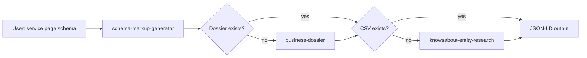

# Install guide — `local-schema` workflow

**Workflow ID:** `local-schema`  
**GitHub:** `SemanticMastery/skills` → `workflows/local-schema/`

Works on **Windows** and **macOS**. Supports **Cursor** and **Claude Code** (install to one or both).

---

## 1. Prerequisites

| Requirement | Notes |
|-------------|--------|
| **Node.js 18+** | [https://nodejs.org](https://nodejs.org) — for dossier compose and `resolve-entity-urls.mjs` |
| **Cursor** and/or **Claude Code** | Skills are markdown instructions read by the agent |
| **GROK_API_KEY** | Required for full business dossier (xAI Grok 4.3) |
| **SERPAPI_API_KEY** | Strongly recommended for dossier pre-gather and GBP category fetch |
| **Firecrawl CLI** | Authenticated (`firecrawl --status` succeeds) for website/review pre-gather |

Optional: `DATAFORSEO_USERNAME` / `DATAFORSEO_PASSWORD` — fallback in `get-gbp-categories.mjs` if SerpAPI is unavailable.

### Set environment variables

**Windows (User):** Settings → System → About → Advanced system settings → Environment Variables → User variables.

**macOS / Linux (shell profile):**

```bash
export GROK_API_KEY="your-key"
export SERPAPI_API_KEY="your-key"
```

Restart Cursor / Claude Code after changing env vars.

### Firecrawl CLI

Install and log in per [Firecrawl docs](https://docs.firecrawl.dev/). Verify:

```bash
firecrawl --status
```

---

## 2. Unpack the bundle

Extract the **`local-schema`** zip **or** clone the skills repo and use the workflow folder:

```text
<BUNDLE_ROOT>/          # = workflows/local-schema in the repo
├── skills/
├── scripts/seo/
├── LICENSE
├── INSTALL.md
└── ...
```

Set **`BUNDLE_ROOT`** to the **`local-schema`** directory (absolute path recommended). If you cloned the full monorepo, that is `.../skills/workflows/local-schema`, not the repo root.

**Windows (PowerShell, current session):**

```powershell
$env:BUNDLE_ROOT = "C:\path\to\semantic-links-schema-workflow"
```

**macOS / Linux:**

```bash
export BUNDLE_ROOT="/path/to/semantic-links-schema-workflow"
```

Persist `BUNDLE_ROOT` in your shell profile or Windows User env if you want it available in every terminal.

---

## 3. Install Node dependencies

```bash
cd "$BUNDLE_ROOT/scripts/seo"
npm install
```

The dossier scripts have **no required npm packages** today; this step confirms Node can run the pipeline folder.

---

## 4. Install skills — Cursor

Copy the three skill folders into your **global** Cursor skills directory:

| OS | Path |
|----|------|
| Windows | `%USERPROFILE%\.cursor\skills\` |
| macOS / Linux | `~/.cursor/skills/` |

Copy from the bundle:

- `skills/schema-markup-generator/`
- `skills/knowsabout-entity-research/`
- `skills/business-dossier/`

Restart Cursor (or reload window) so skills are discovered.

---

## 5. Install skills — Claude Code

Copy the same three folders to:

```text
~/.claude/skills/
```

Restart Claude Code after copying.

---

## 6. Skills that do not auto-run

These skills use `disable-model-invocation: true`:

| Skill | You must |
|-------|----------|
| `business-dossier` | Name the skill explicitly in chat when schema or your workflow needs a dossier |
| `knowsabout-entity-research` | Invoke explicitly when entity CSVs are missing |

`schema-markup-generator` **will stop** at preflight steps and tell you to invoke the other skills — it will not silently run them.

---

## 7. Verify — FAQ-only path (no dossier, no CSV)

Goal: confirm `schema-markup-generator` is installed without running paid APIs.

1. Open a **client project folder** in Cursor or Claude Code.
2. Ask: *"Generate FAQ schema for [URL or paste FAQ Q&A]. Skip dossier and entity CSV — FAQ only."*
3. Expect JSON-LD output and references to the skill’s validation guide.

If the agent cannot find the skill, confirm the folder name matches `schema-markup-generator` under your skills directory.

---

## 8. Verify — business dossier (optional)

From a client `project_dir`:

```bash
node "$BUNDLE_ROOT/scripts/seo/compose-business-dossier.mjs" \
  --name "Test Business" \
  --address "123 Main St, City, ST 00000" \
  --phone "555-555-5555" \
  --website "https://example.com" \
  --gbp-url "https://maps.app.goo.gl/YOUR_GBP_LINK" \
  --project-dir "/absolute/path/to/client/project" \
  --dry-run
```

**Windows (PowerShell):**

```powershell
node "$env:BUNDLE_ROOT\scripts\seo\compose-business-dossier.mjs" `
  --name "Test Business" `
  --address "123 Main St, City, ST 00000" `
  --phone "555-555-5555" `
  --website "https://example.com" `
  --gbp-url "https://maps.app.goo.gl/YOUR_GBP_LINK" `
  --project-dir "C:\path\to\client\project" `
  --dry-run
```

Expect stdout JSON with `dry_run: true` and `grok_api_key_present`. Without keys, you should see a clear missing-key message (see Troubleshooting).

**DOCX note:** `.docx` generation uses PowerShell `Compress-Archive` on Windows. On macOS, Markdown output still works; DOCX may require a future cross-platform zip step or running compose on Windows.

---

## 9. Verify — entity URL resolver

From bundle root:

```bash
node "$BUNDLE_ROOT/skills/knowsabout-entity-research/scripts/resolve-entity-urls.mjs" \
  --names "Plumber,Plumbing"
```

---

## 10. Full contractor path (overview)



1. Run **business-dossier** after confirming NAPW + GBP URL.
2. Run **knowsabout-entity-research** for each service/location slug missing `resources/schema/knowsabout/{slug}-knowsabout.csv`.
3. Run **schema-markup-generator** for the page.

---

## Troubleshooting

| Issue | Fix |
|-------|-----|
| `Missing GROK_API_KEY` | Set User env var; restart IDE |
| `SERPAPI_API_KEY not set` | Set key or use `--skip-pregather` (not recommended for production dossiers) |
| `firecrawl` not found | Install CLI; ensure on PATH |
| Agent uses old absolute paths | Re-copy skills from a fresh bundle; set `BUNDLE_ROOT` |
| Skill not discovered | Folder must be named exactly `schema-markup-generator` under `skills/` |
| SerpAPI / Firecrawl cost concerns | Use FAQ-only schema path; run dossier only when needed |

---

## Cost reference (approximate)

| Step | Cost driver |
|------|-------------|
| SerpAPI pre-gather | ~2 credits per dossier |
| Firecrawl pre-gather | Several scrape/search operations |
| Grok 4.3 + tools | Variable (xAI billing) |
| Dry run | Free |

See `skills/business-dossier/SKILL.md` for the full table.
